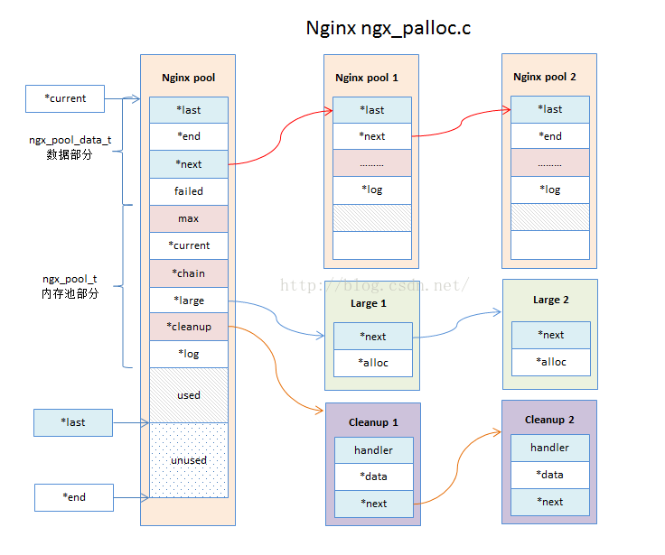
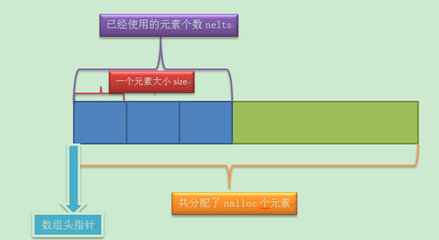
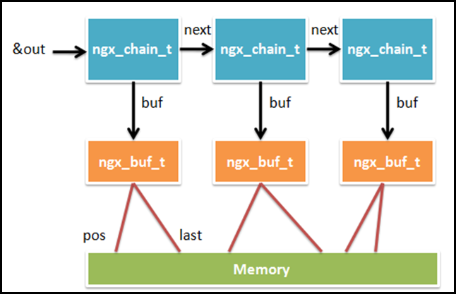
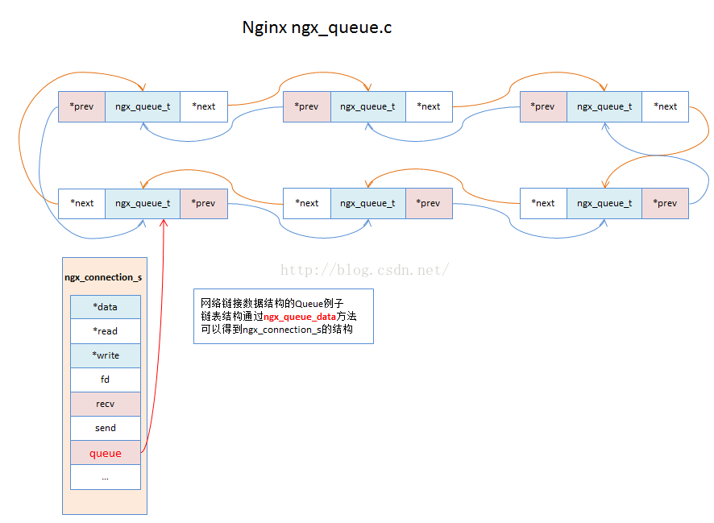
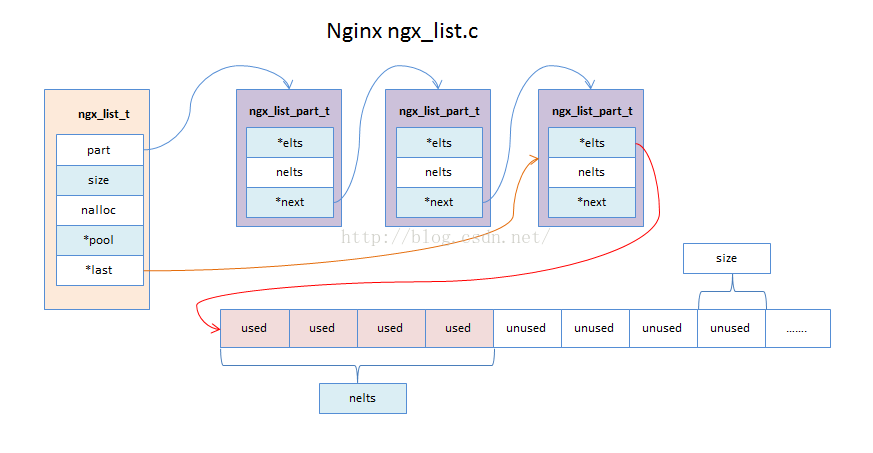
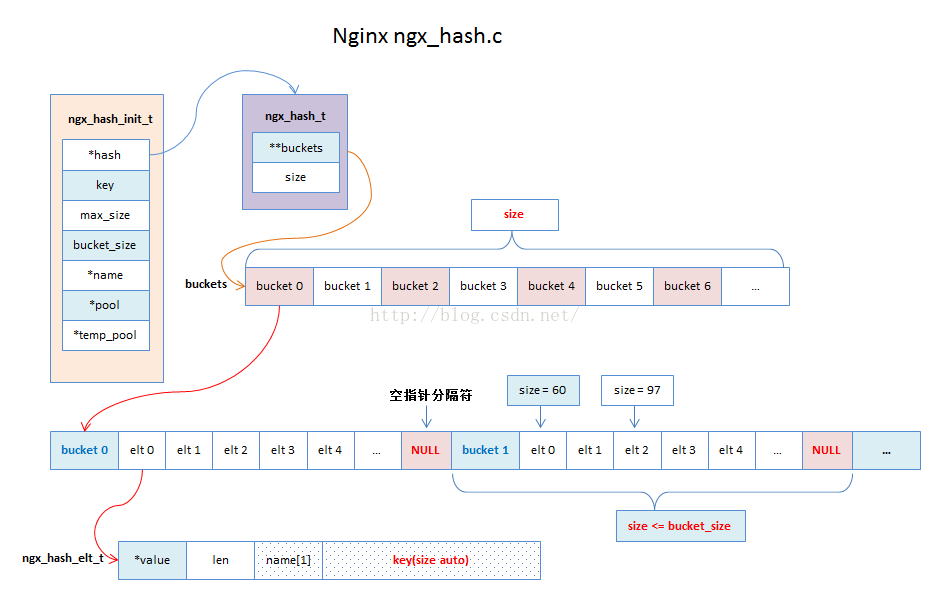

typora-copy-images-to: ./

# Nginx 源码分析

## 目录

[TOC]


## 一、关于零碎知识点的补充

```c
//首先是这两个定义
typedef  intptr_t      ngx_int_t;
typedef  uintptr_t    ngx_uint_t;
```

这两个数据类型是ISO C99定义的，具体代码在linux平台的/usr/include/stdint.h头文件中。

该头文件中定义intptr_t和uintptr_t这两个数据类型的代码片段如下：

```c
/* Types for `void *' pointers.  */
#if __WORDSIZE == 64
# ifndef __intptr_t_defined
typedef long int		intptr_t;
#  define __intptr_t_defined
# endif
typedef unsigned long int	uintptr_t;

#else


# ifndef __intptr_t_defined
typedef int			intptr_t;
#  define __intptr_t_defined
# endif
typedef unsigned int		uintptr_t;
#endif
/*
	在64位的机器上，intptr_t和uintptr_t分别是long intunsigned long int的别名；在32位的机器上,intptr_t和uintptr_t分别是int、unsigned int的别名。
	方便程序载64位与32为操作系统上移植
*/
```

关于在结构体位域定义的说明

​	有些信息在存储时，并不需要占用一个完整的字节， 而只需占几个或一个二进制位。例如在存放一个开关量时，只有0和1 两种状态， 用一位二进位即可。为了节省存储空间，并使处理简便，C语言又提供了一种数据结构，称为“位域”或“位段”。所谓“位域”是把一个字节中的二进位划分为几 个不同的区域， 并说明每个区域的位数。每个域有一个域名，允许在程序中按域名进行操作。 这样就可以把几个不同的对象用一个字节的二进制位域来表示。

​	位域的定义和位域变量的说明位域定义与结构定义相仿，其形式为：  
　　struct 位域结构名  

　　{ 位域列表 };
　　其中位域列表的形式为： 类型说明符 位域名：位域长度  

```c
struct bs
{
    int a:8;
    int b:2;
    int c:6;
}data;  

说明data为bs变量，共占两个字节。其中位域a占8位，位域b占2位，位域c占6位。
```


## 二、关于nginx模块分析

### 1、内存池

**内存池基本操作**

内存池对外的主要方法有：

| 创建内存池         | ngx_pool_t *  ngx_create_pool(size_t size, ngx_log_t *log); |
| ------------------ | ----------------------------------------------------------- |
| 销毁内存池         | void ngx_destroy_pool(ngx_pool_t *pool);                    |
| 重置内存池         | void ngx_reset_pool(ngx_pool_t *pool);                      |
| 内存申请（对齐）   | void *  ngx_palloc(ngx_pool_t *pool, size_t size);          |
| 内存申请（不对齐） | void *  ngx_pnalloc(ngx_pool_t *pool, size_t size);         |
| 内存清除           | ngx_int_t  ngx_pfree(ngx_pool_t *pool, void *p);            |

关于一些内存池的结构体:

**数据结构体**

```c
//ngx_pool_data_t  数据域
typedef struct {
    u_char               *last;  	/*内存池中未使用的内存开始节点的地址*/
    u_char               *end;		/*内存池的结束地址*/
    ngx_pool_t           *next;		/*指向下一个内存池*/
    ngx_uint_t            failed;	/*失败次数*/
} ngx_pool_data_t;
```

**大块数据结构**

```c
struct ngx_pool_large_s {
    ngx_pool_large_t     *next;   /* 指向下一个存储地址 通过这个地址可以知道当前块长度 */
    void                 *alloc;  /* 数据块指针地址 */
};
```

**内存池结构体**

```c
struct ngx_pool_s {
    ngx_pool_data_t       d; 		/*内存池的数据区域*/
    size_t                max;		/*最大每次可分配内存*/
    ngx_pool_t           *current;	/*指向当前内存池指针地址.ngx_pool_t链表上最后一个缓存池结构*/
    ngx_chain_t          *chain;	/*缓冲区链表*/
    ngx_pool_large_t     *large;	/*存储大数据链表*/
    ngx_pool_cleanup_t   *cleanup;	/*自定义会掉函数,清除内存块分配的内存*/
    ngx_log_t            *log;		/*日志*/
};
```

​	Nginx的内存池会放在ngx_pool_t的数据结构上（ngx_pool_data_t用于记录内存块block的可用地址空间和内存块尾部）。当初始化分配的内存块大小不能满足需求的时候，Nginx就会调用ngx_palloc_block函数来分配一个新的内存块，通过链表的形式连接起来。

​	当申请的内存大于pool->max的值的时候，Nginx就会单独分配一块large的内存块，会放置在pool->large的链表结构上。

​	pool->cleanup的链表结构主要存放需要通过回调函数清理的内存数据。（例如文件描述符）




#### 1.内存池的创建函数:ngx_create_pool

​	nginx对内存的管理分为大内存与小内存，当某一个申请的内存大于某一个值时，就需要从大内存中分配空间，否则从小内存中分配空间。 
​	nginx中的内存池是在创建的时候就设定好了大小，在以后分配小块内存的时候，如果内存不够，则是重新创建一块内存串到内存池中，而不是将原有的内存池进行扩张。当要分配大块内存是，则是在内存池外面再分配空间进行管理的，称为大块内存池。

```c
/**
 * 创建一个内存池
 */
ngx_pool_t *ngx_create_pool(size_t size, ngx_log_t *log) 
{
	ngx_pool_t *p;
 
	/**
	 * 相当于分配一块内存 ngx_alloc(size, log)
	 */
	p = ngx_memalign(NGX_POOL_ALIGNMENT, size, log);
	if (p == NULL) {
		return NULL;
	}
 
	/**
	 * Nginx会分配一块大内存，其中内存头部存放ngx_pool_t本身内存池的数据结构
	 * ngx_pool_data_t	p->d 存放内存池的数据部分（适合小于p->max的内存块存储）
	 * p->large 存放大内存块列表
	 * p->cleanup 存放可以被回调函数清理的内存块（该内存块不一定会在内存池上面分配）
	 */
	p->d.last = (u_char *) p + sizeof(ngx_pool_t); //内存开始地址，指向ngx_pool_t结构体之后数据取起始位置
	p->d.end = (u_char *) p + size; //指向内存结束地址
	p->d.next = NULL; //下一个ngx_pool_t 内存池地址
	p->d.failed = 0; //失败次数
 
	size = size - sizeof(ngx_pool_t);//从分配内存的空间中减去自己本身的内存
	p->max = (size < NGX_MAX_ALLOC_FROM_POOL) ? size : NGX_MAX_ALLOC_FROM_POOL;
 
	/* 只有缓存池的父节点，才会用到下面的这些  ，子节点只挂载在p->d.next,并且只负责p->d的数据内容*/
	p->current = p;
	p->chain = NULL;
	p->large = NULL;
	p->cleanup = NULL;
	p->log = log;
 
	return p;
}

```

#### 2.使用内存池分配一块内存ngx_palloc和ngx_pnalloc

内存分配逻辑:
1. 分配一块内存，如果分配的内存size小于内存池的pool->max的限制，则属于小内存块分配，走小内存块分配逻辑；否则走大内存分配逻辑。

2. 小内存分配逻辑：循环读取pool->d上的内存块，是否有足够的空间容纳需要分配的size，如果可以容纳，则直接分配内存；否则内存池需要申请新的内存块，调用ngx_palloc_block。

3. 大内存分配逻辑：当分配的内存size大于内存池的pool->max的限制，则会直接调用ngx_palloc_large方法申请一块独立的内存块，并且将内存块挂载到pool->large的链表上进行统一管理。
```c
/**
 * 内存池分配一块内存，返回void类型指针
 */
void *
ngx_palloc(ngx_pool_t *pool, size_t size) {
	u_char *m;
	ngx_pool_t *p;
 
	/* 判断每次分配的内存大小，如果超出pool->max的限制，则需要走大内存分配策略 */
	if (size <= pool->max) {
 
		p = pool->current;
 
		/*
		 * 循环读取缓存池链p->d.next的各个的ngx_pool_t节点，
		 * 如果剩余的空间可以容纳size，则返回指针地址
		 *
		 * 这边的循环，实际上最多只有4次，具体可以看ngx_palloc_block函数
		 * */
		do {
			/* 对齐操作,会损失内存，但是提高内存使用速度 */
			m = ngx_align_ptr(p->d.last, NGX_ALIGNMENT);
 
 			/*
 				此位置通过前面对其猴的p->d.last的起始位置与p->d.end相减,如果大于size
 				则调整p->d.last的位置,分配给相应的m,到此如果分配成功则分配结束.
 			*/
			if ((size_t)(p->d.end - m) >= size) {
				p->d.last = m + size;
				return m;
			}
 			//如果当前的ngx_pool_t内存池块没有足够的空间,则去下一块查找,直到所有内存块都没空间
			p = p->d.next;
 
		} while (p);
 
		/* 如果没有缓存池空间没有可以容纳大小为size的内存块，则需要重新申请一个缓存池pool节点 */
		return ngx_palloc_block(pool, size);
	}
 
	/* 走大数据分配策略 ，在pool->large链表上分配 */
	return ngx_palloc_large(pool, size);
}


/**
 * 内存池分配一块内存，返回void类型指针
 * 不考虑对齐情况
 */
void *
ngx_pnalloc(ngx_pool_t *pool, size_t size) {
	u_char *m;
	ngx_pool_t *p;
 
	/* 判断每次分配的内存大小，如果超出pool->max的限制，则需要走大数据内存分配策略 */
	if (size <= pool->max) {
 
		p = pool->current;
 
		/* 循环读取数据区域的各个ngx_pool_t缓存池链，如果剩余的空间可以容纳size，则返回指针地址*/
		do {
			m = p->d.last; //分配的内存块的地址
 
			if ((size_t)(p->d.end - m) >= size) {
				p->d.last = m + size;
 
				return m;
			}
 
			p = p->d.next;
 
		} while (p);
 
		/* 如果没有缓存池空间没有可以容纳大小为size的内存块，则需要重新申请一个缓存池*/
		return ngx_palloc_block(pool, size);
	}
 
	/* 走大数据分配策略 */
	return ngx_palloc_large(pool, size);
}
```

**关于ngx_align_ptr宏定义**

​	ngx_align_ptr，这是一个用来内存地址取整的宏，非常精巧，一句话就搞定了。作用不言而喻，取整可以降低CPU读取内存的次数，提高性能。因为这里并没有真正意义调用malloc等函数申请内存，而是移动指针标记而已，所以内存对齐的活，C编译器帮不了你了，得自己动手。

```c
#define ngx_align_ptr(p, a)                                                   \
    (u_char *) (((uintptr_t) (p) + ((uintptr_t) a - 1)) & ~((uintptr_t) a - 1))

```

#### 3.内存池的扩容ngx_palloc_block

这个函数是用来分配新的内存块，为pool内存池开辟一个新的内存块，并申请使用size大小的内存；

```c
/**
 * 申请一个新的缓存池 ngx_pool_t
 * 新的缓存池会挂载在主缓存池的 数据区域 （pool->d->next）
 */
static void *
ngx_palloc_block(ngx_pool_t *pool, size_t size) {
	u_char *m;
	size_t psize;
	ngx_pool_t *p, *new, *current;
 
 	/*计算内存池第一块内存的大小*/
	psize = (size_t)(pool->d.end - (u_char *) pool);
 
	/* 申请新的一块与第一块内存大小一模一样 */
	m = ngx_memalign(NGX_POOL_ALIGNMENT, psize, pool->log);
	if (m == NULL) {
		return NULL;
	}
 
	new = (ngx_pool_t *) m;
 
	new->d.end = m + psize;//设置新的内存块的end
	new->d.next = NULL;
	new->d.failed = 0;
 
	/* 分配size大小的内存块，返回m指针地址 */
	m += sizeof(ngx_pool_data_t);
	m = ngx_align_ptr(m, NGX_ALIGNMENT);//对m指针按4个字节对齐处理
	new->d.last = m + size;//设置新内存块last,即申请使用size大小的内存
 
	current = pool->current;
 
	/**
	 * 缓存池的pool数据结构会挂载子节点的ngx_pool_t数据结构
	 * 子节点的ngx_pool_t数据结构中只用到pool->d的结构，只保存数据
	 * 每添加一个子节点，p->d.failed就会+1，当添加超过4个子节点的时候，
	 * pool->current会指向到最新的子节点地址
	 *
	 * 这个逻辑主要是为了防止pool上的子节点过多，导致每次ngx_palloc循环pool->d.next链表
	 * 将pool->current设置成最新的子节点之后，每次最大循环4次，不会去遍历整个缓存池链表
	 */
	 /*
	 	这里循环用来找最后一个链表节点,这里failed用来控制循环长度,如果分配失败次数达到5次就忽略
	 */
	for (p = current; p->d.next; p = p->d.next) {
		if (p->d.failed++ > 4) {
			current = p->d.next;
		}
	}
 
	p->d.next = new;
 
	/* 最终这个还是没变 */
	pool->current = current ? current : new;
 
	return m;
}
```

#### 4.大内存的分配ngx_palloc_large

​	在**ngx_palloc**中首先会判断申请的内存大小是否超过内存块的最大限值，如果超过，则直接调用ngx_palloc_large，进入大内存块的分配流程；

```c
/**
 * 当分配的内存块大小超出pool->max限制的时候,需要分配在pool->large上
 */
static void *ngx_palloc_large(ngx_pool_t *pool, size_t size) {
	void *p;
	ngx_uint_t n;
	ngx_pool_large_t *large;
 
	/* 分配一块新的大内存块 */
	p = ngx_alloc(size, pool->log);
	if (p == NULL) {
		return NULL;
	}
 
	n = 0;
 
	/* 去pool->large链表上查询是否有NULL的，只在链表上往下查询3次，主要判断大数据块是否有被释放的，如果没有则只能跳出*/
	for (large = pool->large; large; large = large->next) {
		if (large->alloc == NULL) {
			large->alloc = p;
			return p;
		}
 
		if (n++ > 3) {
			break;
		}
	}
 
	/* 分配一个ngx_pool_large_t 数据结构 */
	large = ngx_palloc(pool, sizeof(ngx_pool_large_t));
	if (large == NULL) {
		ngx_free(p); //如果分配失败，删除内存块
		return NULL;
	}
 
	large->alloc = p;
	large->next = pool->large;
	pool->large = large;
 
	return p;
}
```


#### 5.内存池重置ngx_reset_pool

```c
/**
 * 重设内存池
 */
void ngx_reset_pool(ngx_pool_t *pool) {
	ngx_pool_t *p;
	ngx_pool_large_t *l;
 
	/* 清理pool->large链表（pool->large为单独的大数据内存块）  */
	for (l = pool->large; l; l = l->next) {
		if (l->alloc) {
			ngx_free(l->alloc);
		}
	}
 
	pool->large = NULL;
 
	/* 循环重新设置内存池data区域的 p->d.last；data区域数据并不擦除*/
	for (p = pool; p; p = p->d.next) {
		p->d.last = (u_char *) p + sizeof(ngx_pool_t);
	}
}
```


#### 6.大内存块的释放ngx_pfree

​	内存池释放需要走ngx_destroy_pool，独立大内存块的单独释放，可以走ngx_pfree方法。这里说明一下,小块内存好像是没有释放的.

```c
/**
 * 大内存块释放  pool->large
 */
ngx_int_t ngx_pfree(ngx_pool_t *pool, void *p) {
	ngx_pool_large_t *l;
 
	/* 在pool->large链上循环搜索，并且只释放内容区域，不释放ngx_pool_large_t数据结构*/
	for (l = pool->large; l; l = l->next) {
		if (p == l->alloc) {
			ngx_log_debug1(NGX_LOG_DEBUG_ALLOC, pool->log, 0,
					"free: %p", l->alloc);
			ngx_free(l->alloc);
			l->alloc = NULL;
			return NGX_OK;
		}
	}
 
	return NGX_DECLINED;
}
```

​	我们在使用内存池时，可以使用ngx_palloc进行分配，使用ngx_pfree释放。而对于大内存，这样做是没有问题的，而对于小内存就不一样了，分配的小内存，不会进行释放。因为大内存块的分配只对前3个内存块进行检查，否则就直接分配内存，所以大内存块的释放必须及时。

#### 7.内存池清理ngx_pool_cleanup_add

**ngx_pool_cleanup_s**

```c
struct ngx_pool_cleanup_s {
	ngx_pool_cleanup_pt   handler;
	void                 *data;
	ngx_pool_cleanup_t   *next;
};
```

其中

​	handler：是回调函数指针；

​	data：回调时，将此数据传入回调函数；

​	next：//指向下一个回调函数结构体；

​	如果我们需要添加自己的回调函数，则需要调用ngx_pool_cleanup_add来得到一个ngx_pool_cleanup_t，然后设置handler为我们的清理函数，并设置data为我们要清理的数据。这样在ngx_destroy_pool中会循环调用handler清理数据；

​	比如：我们可以将一个开打的文件描述符作为资源挂载到内存池上，同时提供一个关闭文件描述的函数注册到handler上，那么内存池在释放的时候，就会调用我们提供的关闭文件函数来处理文件描述符资源了。


```c
/**
 * 分配一个可以用于回调函数清理内存块的内存
 * 内存块仍旧在p->d或p->large上
 *
 * ngx_pool_t中的cleanup字段管理着一个特殊的链表，该链表的每一项都记录着一个特殊的需要释放的资源。
 * 对于这个链表中每个节点所包含的资源如何去释放，是自说明的。这也就提供了非常大的灵活性。
 * 意味着，ngx_pool_t不仅仅可以管理内存，通过这个机制，也可以管理任何需要释放的资源，
 * 例如，关闭文件，或者删除文件等等的。下面我们看一下这个链表每个节点的类型
 *
 * 一般分两种情况：
 * 1. 文件描述符
 * 2. 外部自定义回调函数可以来清理内存
 */
ngx_pool_cleanup_t *
ngx_pool_cleanup_add(ngx_pool_t *p, size_t size) {
	ngx_pool_cleanup_t *c;
 
	/* 分配一个ngx_pool_cleanup_t */
	c = ngx_palloc(p, sizeof(ngx_pool_cleanup_t));
	if (c == NULL) {
		return NULL;
	}
 
	/* 如果size !=0 从pool->d或pool->large分配一个内存块 */
	if (size) {
		/*  */
		c->data = ngx_palloc(p, size);
		if (c->data == NULL) {
			return NULL;
		}
 
	} else {
		c->data = NULL;
	}
 
	/* handler为回调函数 */
	c->handler = NULL;
	c->next = p->cleanup;
 
	p->cleanup = c;
 
	ngx_log_debug1(NGX_LOG_DEBUG_ALLOC, p->log, 0, "add cleanup: %p", c);
 
	return c;
}
```

接下来手动清理 p->cleanup链表上的数据：（内存池销毁函数ngx_destroy_pool也会清理p->cleanup）

```c
/**
 * 清除 p->cleanup链表上的内存块（主要是文件描述符）
 * 回调函数：ngx_pool_cleanup_file
 */
void ngx_pool_run_cleanup_file(ngx_pool_t *p, ngx_fd_t fd) {
	ngx_pool_cleanup_t *c;
	ngx_pool_cleanup_file_t *cf;
 
	for (c = p->cleanup; c; c = c->next) {
		if (c->handler == ngx_pool_cleanup_file) {
			cf = c->data;
			if (cf->fd == fd) {
				c->handler(cf); /* 调用回调函数 */
				c->handler = NULL;
				return;
			}
		}
	}
}
```

关闭文件的回调函数和删除文件的回调函数。这个是文件句柄通用的回调函数，可以放置在p->cleanup->handler上。

```c
/**
 * 关闭文件回调函数
 * ngx_pool_run_cleanup_file方法执行的时候，用了此函数作为回调函数的，都会被清理
 */
void ngx_pool_cleanup_file(void *data) {
	ngx_pool_cleanup_file_t *c = data;
 
	ngx_log_debug1(NGX_LOG_DEBUG_ALLOC, c->log, 0, "file cleanup: fd:%d",
			c->fd);
 
	if (ngx_close_file(c->fd) == NGX_FILE_ERROR) {
		ngx_log_error(NGX_LOG_ALERT, c->log, ngx_errno,
				ngx_close_file_n " \"%s\" failed", c->name);
	}

```


#### 8.内存池销毁ngx_destroy_pool

```c
/**
 * 销毁内存池。
 */
void ngx_destroy_pool(ngx_pool_t *pool) {
	ngx_pool_t *p, *n;
	ngx_pool_large_t *l;
	ngx_pool_cleanup_t *c;
 
	/* 首先清理pool->cleanup链表 */
	for (c = pool->cleanup; c; c = c->next) {
		/* handler 为一个清理的回调函数 */
		if (c->handler) {
			ngx_log_debug1(NGX_LOG_DEBUG_ALLOC, pool->log, 0,
					"run cleanup: %p", c);
			c->handler(c->data);
		}
	}
 
	/* 清理pool->large链表（pool->large为单独的大数据内存块）  */
	for (l = pool->large; l; l = l->next) {
 
		ngx_log_debug1(NGX_LOG_DEBUG_ALLOC, pool->log, 0, "free: %p", l->alloc);
 
		if (l->alloc) {
			ngx_free(l->alloc);
		}
	}
 
#if (NGX_DEBUG)s[i,j-vi]+pi
 
	/*
	 * we could allocate the pool->log from this pool
	 * so we cannot use this log while free()ing the pool
	 */
 
	for (p = pool, n = pool->d.next; /* void */; p = n, n = n->d.next) {
		ngx_log_debug2(NGX_LOG_DEBUG_ALLOC, pool->log, 0,
				"free: %p, unused: %uz", p, p->d.end - p->d.last);
 
		if (n == NULL) {
			break;
		}
	}
 
#endif
 
	/* 对内存池的data数据区域进行释放 */
	for (p = pool, n = pool->d.next; /* void */; p = n, n = n->d.next) {
		ngx_free(p);
 
		if (n == NULL) {
			break;
		}
	}
}
```

### 2、数组结构ngx_array

​	在分析完基本的内存输出以后，我们可以array去看看内存池的使用方式。Nginx的Array结构设计得非常小巧，主要用于存储小块内存。Nginx的数组每个元素的大小是固定的。

​	数据结构定义：

```c
struct ngx_array_s {
    void        *elts;		//elts指向数组的首地址
    ngx_uint_t   nelts;		//nelts是数组中已经使用的元素的个数
    size_t       size;		//每个数组元素占用内存的大小
    ngx_uint_t   nalloc;	//当前数组能容纳元素的个数
    ngx_pool_t  *pool;		//内存池对象
};
```



​	主要接口

```c
ngx_array_t *ngx_array_create(ngx_pool_t *p, ngx_uint_t n, size_t size);
void ngx_array_destroy(ngx_array_t *a);
void *ngx_array_push(ngx_array_t *a);
void *ngx_array_push_n(ngx_array_t *a, ngx_uint_t n);
```

#### 1.数组的创建函数ngx_array_create

```c
ngx_array_t *
ngx_array_create(ngx_pool_t *p, ngx_uint_t n, size_t size)
{
    ngx_array_t *a;
 
    //从p里面申请一块大小为sizeof(ngx_array_t)的内存
    a = ngx_palloc(p, sizeof(ngx_array_t));
    if (a == NULL) {
        return NULL;
    }
 	//初始化内存
    if (ngx_array_init(a, p, n, size) != NGX_OK) {
        return NULL;
    }
 
    return a;
}
```

初始化内存函数ngx_array_init

```c

static ngx_inline ngx_int_t
ngx_array_init(ngx_array_t *array, ngx_pool_t *pool, ngx_uint_t n, size_t size)
{
    /*
     * set "array->nelts" before "array->elts", otherwise MSVC thinks
     * that "array->nelts" may be used without having been initialized
     */
 	//数组参数进行初始化
    array->nelts = 0;  	//已经使用的个数为0
    array->size = size;	//每个元素占用的大小为size
    array->nalloc = n;	//当前数组能容纳的对象为n
    array->pool = pool;	//内存池指向
 
    //分配n个大小为size的内存，elsts指向首地址
    array->elts = ngx_palloc(pool, n * size);
    if (array->elts == NULL) {
        return NGX_ERROR;
    }
 
    return NGX_OK;
}
```

创建完数组array后，ngx_array_t结构体各成员得到了初始化，其中elts指向实际数组的起始地址。

#### 2.动态数组释放ngx_array_destroy

销毁操作，主要是回退内存池pool的d.last指针，主要操作如下：

​	1、回退p->d.last指针a->size * a->nmalloc大小

​	2、回退p->d.last指针sizeof(ngx_array_t)大小

​	3、回退之后就和没有开辟array一样

```c
void
ngx_array_destroy(ngx_array_t *a)
{
    ngx_pool_t  *p;

    p = a->pool;

    //释放动态数组每一个元素
    if ((u_char *) a->elts + a->size * a->nalloc == p->d.last) {
        p->d.last -= a->size * a->nalloc;
    }

    //释放动态数组首指针
    if ((u_char *) a + sizeof(ngx_array_t) == p->d.last) {
        p->d.last = (u_char *) a;
    }
}
```


#### 3.动态数组的加入元素操作ngx_array_push和ngx_array_push_n

数组加入元素的操作动作主要如下：

​	1、如果现在已经分到的块数nelts还没到最大块数nalloc时，直接分出一个数组单元。

​	2、如果数组已经满了，内存池还有点的话，就从内存池里分一块。

​	3、如果数组已经满了，内存池也不够的话，就再开一个2倍size的数组，把之前的arry拷贝到new开辟的2倍size的数组中

```c
//a为要加入到的动态数组的指针
void * ngx_array_push(ngx_array_t *a)
{
    void        *elt, *new;
    size_t       size;
    ngx_pool_t  *p;

    //使用的和预先分配的个数相等。数组已满
    if (a->nelts == a->nalloc) {           

        /* the array is full */

        //再分配预分配nalloc个，如今就有2*nalloc个了
        size = a->size * a->nalloc; 

        p = a->pool;

        //假设内存池内存还够。直接从内存池分配，仅仅分配一个
        if ((u_char *) a->elts + size == p->d.last
            && p->d.last + a->size <= p->d.end)
        {
            /*
             * the array allocation is the last in the pool
             * and there is space for new allocation
             */
            
            //内存池尾指针后移一个元素大小。分配内存一个元素，并把nalloc+1
            p->d.last += a->size;
            a->nalloc++;

        //假设内存池内存不够了，分配一个新的数组。大小为两倍的nalloc
        } else {
            /* allocate a new array */

            //内存分配
            new = ngx_palloc(p, 2 * size);
            if (new == NULL) {
                return NULL;
            }
            
            //将曾经的数组复制到新数组。并将数组大小设置为曾经二倍
            ngx_memcpy(new, a->elts, size);
            a->elts = new;
            a->nalloc *= 2;
        }
    }

    //已分配个数+1 。并返回之
    elt = (u_char *) a->elts + a->size * a->nelts;
    a->nelts++;

    return elt;
}

//a为要放入的数组，n为要放入的个数
void *ngx_array_push_n(ngx_array_t *a, ngx_uint_t n)
{
    void        *elt, *new;
    size_t       size;
    ngx_uint_t   nalloc;
    ngx_pool_t  *p;

    size = n * a->size;

    //假设数组剩余个数不够分配
    if (a->nelts + n > a->nalloc) {

        /* the array is full */

        p = a->pool;

        //假设内存池中剩余的够分配n个元素，从内存池中分配
        if ((u_char *) a->elts + a->size * a->nalloc == p->d.last
            && p->d.last + size <= p->d.end)
        {
            /*
             * the array allocation is the last in the pool
             * and there is space for new allocation
             */

            p->d.last += size;
            a->nalloc += n;
        //假设内存池中剩余的不够分配n个元素
        } else {
            /* allocate a new array */
            
            //当n比数组预分配个数nalloc大时。分配2n个，否则分配2*nalloc个
            nalloc = 2 * ((n >= a->nalloc) ? n : a->nalloc);

            new = ngx_palloc(p, nalloc * a->size);
            if (new == NULL) {
                return NULL;
            }
            
            //拷贝曾经元素，设置nalloc
            ngx_memcpy(new, a->elts, a->nelts * a->size);
            a->elts = new;
            a->nalloc = nalloc;
        }
    }

    //添加已分配个数，并返回
    elt = (u_char *) a->elts + a->size * a->nelts;
    a->nelts += n;

    return elt;
}
```

实战代码：

```c
typedef struct
{    
     u_char *name;    
     int age;
}Student;
  
ngx_array_t* pArray = ngx_array_create(cf->pool,1,sizeof(Student));
 
Student *pStudent = ngx_array_push(pArray);
pStudent->age = 10;
  
Students *pStudents  = ngx_array_push_n(pArray,3);
pStudents->age = 1;
(pStudents  + 1 )->age =2;
(pStudents  + 2 )->age = 3; 

//遍历
Student *pStudent = pArray->elts;
ngx_uint_i = 0;
for(; i < pArray->nelts;i++)
{
    a = pStudent  + i;
    //....
 }
```

### 3、缓冲区结构ngx_buf

Nginx的buf缓冲区数据结构，主要用来存储非常大块的内存。ngx_buf_t数据结构也贯穿了整个Nginx。

Nginx的缓冲区设计是比较灵活的。

1. 可以自定义管理业务层面的缓冲区链表；

2. 也可以将空闲的缓冲区链表交还给内存池pool->chain结构。

缓冲区ngx_buf_t是nginx处理大数据的关键数据结构，它既应用于内存数据也应用于磁盘数据。

关于缓冲区链表结构



其中ngx_chain_t为链表，ngx_buf_t为缓冲区结点

关于buf的结构体的说明

```c
typedef struct ngx_buf_s  ngx_buf_t;
/**
 * Nginx缓冲区
 */
struct ngx_buf_s {
    u_char          *pos;           /* 待处理数据的开始标记  */
    u_char          *last;          /* 待处理数据的结尾标记 */
    off_t            file_pos;		/* 处理文件时，待处理的文件开始标记  */
    off_t            file_last;		/* 处理文件时，待处理的文件结尾标记  */
 
    u_char          *start;         /* 缓冲区开始的指针地址 */
    u_char          *end;           /* 缓冲区结尾的指针地址 */
    ngx_buf_tag_t    tag;			/* 缓冲区标记地址，是一个void类型的指针。 */
    ngx_file_t      *file;			/* 引用的文件 */
    ngx_buf_t       *shadow;
    /*
    当前缓冲区的影子缓冲区，该成员很少用到。当缓冲区转发上游服务器的响应时才使用了shadow成员，
    这是因为nginx太节约内存了，分配一块内存并使用ngx_buf_t表示接收到的上游服务器响应后，
    在向下游客户端转发时可能会把这块内存存储到文件中，也可能直接向下游发送，此时nginx绝对不会
  	重新复制一份内存用于新的目的，而是再次建立一个ngx_buf_t结构体指向原内存，这样多个ngx_buf_t
    结构体指向了同一份内存，它们之间的关系就通过shadow成员来引用，一般不建议使用。
    */
 
 
    /* the buf's content could be changed */
 
    unsigned         temporary:1;	 /* 标志位，为1时，内存可修改 */
 
    /*
     * the buf's content is in a memory cache or in a read only memory
     * and must not be changed
     */
    unsigned         memory:1;   	/* 标志位，为1时，内存只读 */
 
    /* the buf's content is mmap()ed and must not be changed */
    unsigned         mmap:1;		/* 标志位，为1时，mmap映射过来的内存，不可修改 */
 
    unsigned         recycled:1;	/* 标志位，为1时，可回收 */
    unsigned         in_file:1;		/* 标志位，为1时，表示处理的是文件 */
    unsigned         flush:1;		/* 标志位，为1时，表示需要进行flush操作 */
    unsigned         sync:1;		/* 标志位，为1时，表示可以进行同步操作，容易引起堵塞 */
    unsigned         last_buf:1;	/* 标志位，为1时，表示为缓冲区链表ngx_chain_t上的最后一块待处理缓冲区 */
    unsigned         last_in_chain:1;/* 标志位，为1时，表示为缓冲区链表ngx_chain_t上的最后一块缓冲区 */
 
    unsigned         last_shadow:1;	/* 标志位，为1时，表示是否是最后一个影子缓冲区 */
    unsigned         temp_file:1;	/* 标志位，为1时，表示当前缓冲区是否属于临时文件 */
 
    /* STUB */ int   num;
};
```

1. 从上面这个数据结构中，可以看到ngx_buf_t结构，即可以处理内存，也可以处理文件。

2. Nginx使用了位域的方法，节省存储空间。

3. 每个buf都记录了开始和结束点以及未处理的开始和结束点，因为缓冲区的内存申请了之后，是可以被复用的。

4. 所有缓冲区需要的数据结构以及缓冲区的buf内存块都会被分配到内存池上面。


缓冲区链表结构 ngx_chain_t

```c
typedef struct ngx_chain_s       ngx_chain_t;
/**
 * 缓冲区链表结构，放在pool内存池上面
 */
struct ngx_chain_s {
    ngx_buf_t    *buf;
    ngx_chain_t  *next;
};
```

1. 是否还记得内存池结构中，有一个数据结构pool->chain就是保存空闲的缓冲区链表的。
2. Nginx的缓冲区ngx_buf_t，通过ngx_chain_t链表结构进行关联和管理。
3. 通过链表的方式实现buf有一个非常大的好处：如果一次需要缓冲区的内存很大，那么并不需要分配一块完整的内存，只需要将缓冲区串起来就可以了。


1. Nginx的缓冲区数据结构主要包含链表数据结构ngx_chain_t和buf数据结构ngx_buf_t

2. Nginx可以在自定义的业务层面管理繁忙busy和空闲free的缓冲区链表结构。通过后边的函数，可以对缓冲区的链表结构和buf结构进行管理。

3. 如果缓冲区链表需要被回收，则会放到Nginx内存池的pool->chain链表上。

4. 缓冲区是Nginx用的非常多的一种数据结构，主要用于接收和输出HTTP的数据信息。所以对Nginx的缓冲区的数据结构深入理解非常有必要。

 

#### 1.创建一个缓冲区buf ngx_create_temp_buf

​	ngx_create_temp_buf直接从pool上创建一个缓冲区的buf，buf大小可以自定义。buf的数据结构和buf内存块都会被创建到pool内存池上。

```c
/**
 * 创建一个缓冲区。需要传入pool和buf的大小
 */
ngx_buf_t *
ngx_create_temp_buf(ngx_pool_t *pool, size_t size)
{
	ngx_buf_t *b;
 
	/* 最终调用的是内存池pool，开辟一段内存用作缓冲区，主要放置ngx_buf_t结构体 */
	b = ngx_calloc_buf(pool);
	if (b == NULL) {
		return NULL;
	}
 
	/* 分配缓冲区内存;  pool为内存池，size为buf的大小*/
	b->start = ngx_palloc(pool, size);
	if (b->start == NULL) {
		return NULL;
	}
 
	/*
	 * set by ngx_calloc_buf():
	 *
	 *     b->file_pos = 0;
	 *     b->file_last = 0;
	 *     b->file = NULL;
	 *     b->shadow = NULL;
	 *     b->tag = 0;
	 *     and flags
	 */
 
	b->pos = b->start;  //待处理数据的标记指针
	b->last = b->start; //待处理数据的结尾标记指针
	b->end = b->last + size; //缓冲区结尾地址
	b->temporary = 1;
 
	return b;
}
```

​	这段代码是表示怎样创建生成一个temp的buf，并且从代码中也可以看到一段buf的内存空间是怎样分配的，通过ngx_palloc这个函数来完成分配的，并且由于在初始创建buf结构体的时候使用的函数是ngx_calloc_buf，所以针对分配的内存实行了清零操作

#### 2.创建一个缓冲区的链表结构 ngx_alloc_chain_link

​	单独创建缓冲区ngx_buf_t是没法形成回收和管理机制的。所以需要创建ngx_chain_t缓冲区链表结构，用来管理整个缓冲区。

```c
/**
 * 创建一个缓冲区的链表结构
 */
ngx_chain_t *
ngx_alloc_chain_link(ngx_pool_t *pool)
{
	ngx_chain_t *cl;
	/*
	 * 首先从内存池中去取ngx_chain_t，
	 * 被清空的ngx_chain_t结构都会放在pool->chain 缓冲链上
	 */
	cl = pool->chain;
 
	if (cl) {
		pool->chain = cl->next;
		return cl;
	}
	/* 如果取不到，则从内存池pool上分配一个数据结构  */
	cl = ngx_palloc(pool, sizeof(ngx_chain_t));
	if (cl == NULL) {
		return NULL;
	}
 
	return cl;
}
```

#### 3.批量创建多个缓冲区buf ngx_create_chain_of_bufs

​	批量创建多个buf，并且用链表串起来。当我们需要的缓冲区非常大的时候，可以通过此方法，分配一个缓冲区链表，用于缓冲区的数据管理。

```c
/**
 * 批量创建多个buf，并且用链表串起来
 */
ngx_chain_t *
ngx_create_chain_of_bufs(ngx_pool_t *pool, ngx_bufs_t *bufs)
{
	u_char *p;
	ngx_int_t i;
	ngx_buf_t *b;
	ngx_chain_t *chain, *cl, **ll;
 
	/* 在内存池pool上分配bufs->num个 buf缓冲区 ，每个大小为bufs->size */
	p = ngx_palloc(pool, bufs->num * bufs->size);
	if (p == NULL) {
		return NULL;
	}
 
	ll = &chain;
 
	/* 循环创建BUF，并且将ngx_buf_t挂载到ngx_chain_t链表上，并且返回链表*/
	for (i = 0; i < bufs->num; i++) {
 
		/* 最终调用的是内存池pool，开辟一段内存用作缓冲区，主要放置ngx_buf_t结构体 */
		b = ngx_calloc_buf(pool);
		if (b == NULL) {
			return NULL;
		}
 
		/*
		 * set by ngx_calloc_buf():
		 *
		 *     b->file_pos = 0;
		 *     b->file_last = 0;
		 *     b->file = NULL;
		 *     b->shadow = NULL;
		 *     b->tag = 0;
		 *     and flags
		 *
		 */
 
		b->pos = p;
		b->last = p;
		b->temporary = 1;
 
		b->start = p;
		p += bufs->size; //p往前增
		b->end = p;
 
		/* 分配一个ngx_chain_t */
		cl = ngx_alloc_chain_link(pool);
		if (cl == NULL) {
			return NULL;
		}
 
		/* 将buf，都挂载到ngx_chain_t链表上，最终返回ngx_chain_t链表 */
		cl->buf = b;
		*ll = cl;
		ll = &cl->next;
	}
 
	*ll = NULL;
 
	/* 最终得到一个分配了bufs->num的缓冲区链表  */
	return chain;
}
```

​	这段代码则表明了ngx_bufs_t类型是怎样运用的，利用num 和 size来创建一段缓冲区，该缓冲区用于表示ngx_chain_t中的所有的节点中的buf都是从该段缓冲区中分配出来的，但是所有的cl都是从pool中的chain中分配下来重新利用的或者是重新创建的（详细情况查看ngx_alloc_chain_link函数）。

​	从这里我们可以看到nginx的内存分配管理其实本质上或者说基础的方法和手段是利用ngx_pool_t结构体。所以说下一步需要对这个nginx中重要的内存分配管理的部分进行查看和分析。然后还存在多个针对ngx_buf_t类型的基本操作（其实应该说是针对ngx_chain_t类型的基本操作ngx_chain_add_copy

#### 4.拷贝缓冲区链表 ngx_chain_add_copy

将其它缓冲区链表放到已有缓冲区链表结构的尾部。

```c
/**
 * 将其它缓冲区链表放到已有缓冲区链表结构的尾部
 */
ngx_int_t ngx_chain_add_copy(ngx_pool_t *pool, ngx_chain_t **chain,
		ngx_chain_t *in)
{
	ngx_chain_t *cl, **ll;
 
	ll = chain; //chain 指向指针的指针，很绕
 
	/* 找到缓冲区链表结尾部分，cl->next== NULL；cl = *chain既为指针链表地址*/
	for (cl = *chain; cl; cl = cl->next) {
		ll = &cl->next;
	}
 
	/* 遍历in */
	while (in) {
		cl = ngx_alloc_chain_link(pool);
		if (cl == NULL) {
			return NGX_ERROR;
		}
 
		cl->buf = in->buf; //in上的buf拷贝到cl上面
		*ll = cl; //并且放到chain链表上
		ll = &cl->next; //链表往下走
		in = in->next; //遍历，直到NULL
	}
 
	*ll = NULL;

	return NGX_OK;
}
```

​	该函数是在现有的chain的基础上将一个链表“复制”连接到该chain后面，但是从操作中我们可以看到，这个过程虽然说是“复制”，但是针对buf中实际的内存的操作仅仅是将针对连接上罢了。

#### 5.获取一个空闲的buf链表结构 ngx_chain_get_free_buf

```c
/**
 * 冲空闲的buf链表上，获取一个未使用的buf链表
 */
ngx_chain_t *
ngx_chain_get_free_buf(ngx_pool_t *p, ngx_chain_t **free)
{
	ngx_chain_t *cl;
 
	/* 空闲列表中有数据，则直接返回 */
	if (*free) {
		cl = *free;
		*free = cl->next;
		cl->next = NULL;
		return cl;
	}
 
	/* 否则分配一个新的buf */
	cl = ngx_alloc_chain_link(p);
	if (cl == NULL) {
		return NULL;
	}
 
	cl->buf = ngx_calloc_buf(p);
	if (cl->buf == NULL) {
		return NULL;
	}
 
	cl->next = NULL;
 
	return cl;
}
```

​	这段代码从名字上来看是获得一个free的buf，实际上是从一个free的链表中获得一个chain节点或者是重新分配一个chain节点
​	nginx中的链表操作很多都是头链表操作，即如果需要添加链表元素的话通常都将该元素添加到头上


释放缓冲区链表 ngx_free_chain和ngx_chain_update_chains 

​	ngx_free_chain：直接交还给Nginx内存池的pool->chain空闲buf链表

​	ngx_chain_update_chains：可以交还给自定义的空闲链表上。

```c
//直接交还给缓存池
#define ngx_free_chain(pool, cl)                                             \
    cl->next = pool->chain;                                                  \
    pool->chain = cl

/**
 * 释放BUF
 * 1. 如果buf不为空，则不释放
 * 2. 如果cl->buf->tag标记不一样，则直接还给Nginx的pool->chain链表
 * 3. 如果buf为空，并且需要释放，则直接释放buf，并且放到free的空闲列表上
 */
void ngx_chain_update_chains(ngx_pool_t *p, ngx_chain_t **free,
		ngx_chain_t **busy, ngx_chain_t **out, ngx_buf_tag_t tag)
{
	ngx_chain_t *cl;
 
	/* *busy 指向OUT，将已经输出的out放到busy链表上 */
	if (*busy == NULL) {
		*busy = *out;
 
	} else {
		for (cl = *busy; cl->next; cl = cl->next) { /* void */}
		cl->next = *out;
	}
 
	*out = NULL;
 
	/* 遍历 busy链表 */
	while (*busy) {
		cl = *busy;
 
		/* 如果buf不为空，则继续遍历 */
		if (ngx_buf_size(cl->buf) != 0) {
			break;
		}
 
		/* 如果标识一样，则释放这个BUF */
		if (cl->buf->tag != tag) {
			*busy = cl->next;
			ngx_free_chain(p, cl); //还给Nginx pool->chain
			continue;
		}
 
		/* 直接将buf使用的部分回归到 起点指针地址 */
		cl->buf->pos = cl->buf->start;
		cl->buf->last = cl->buf->start;
 
		*busy = cl->next; //继续往后遍历
 
		/* 并且将cl放到free列表上 */
		cl->next = *free;
		*free = cl;
	}
}
```

​	需要处理的链表是out指针指向的链表，而free指向的应该就是当前存在的free链表，而busy链表则是当前存在的busy链表，该链表也是待处理的链表
​	所以开始的时候需要判断将out应该放到哪一个位置，如果busy当前就存在的话，那么就应该将out放置到busy的最后，如果当前busy链表不存在，那么处理就是将其作为busy链表进行处理
​	而后面的操作则是说明从头对busy链表实行检查，如果busy链表中的buf还存在需要处理的内存空间，那么就需要停止处理，否则就将其置为空（即对last和pos进行处理）

### 4、双向链表结构 ngx_queue

 	Nginx双向链表ngx_queue_t是采用"寄宿"在元素中的包含prev和next的ngx_queue_s来实现的。Linux内核中的page管理同样也使用到了这样的链接结构。linux内核情景分析 这样描述道：linux内核作者将prev和next从具体的“宿主”数据结构中抽象成为一个结构体list_head，这样list_head就可以成为该“宿主”的“连接件”。（kernel：include/linux/list.h , include/linux/mm.h ）

​	采用ngx_quque_t来构建双向链表，可以将链表的链接操作相关的数据结构抽象出来，这样有利于进行链表操作函数的编写。其次，用ngx_queue_t结构串接起来的链表可以是不同类型的数据类型（只要这个数据类型包含ngx_quque_t这个数据结构）。打个不恰当的比喻，不管什么样的物品（数据类型），只要物品上有个孔（ngx_quque_t）我们就能用线（ngx_queue_t构成的链）将这些物品串起来。再者，对于链表而言，进行排序，移动元素等操作只需要修改ngx_queue_t中的相关指针即可，所以也称Nginx的双向链表结构为轻量级链表。


链表数据结构 ngx_queue_t

```c
typedef struct ngx_queue_s ngx_queue_t;
 
/**
 * 链表的数据结构非常简单，ngx_queue_s会挂载到实体
 * 结构上。然后通过ngx_queue_s来做成链表
 */
struct ngx_queue_s {
	ngx_queue_t *prev;
	ngx_queue_t *next;
};
```

1. prev：前一个元素。
2. next：后一个元素。

大家都看到这个链表的数据结构非常简单，甚至没有和任何的业务数据结构关联起来。但是如何用的呢？

一般情况下，会在业务的数据结构中，放置一个ngx_queue_t的数据结构。通过这个数据结构进行双向链表的连接。

例如下面的数据结构：

```c
/**
 * 该结构体用于描述一个网络连接
 */
struct ngx_connection_s {
	void *data; //连接未使用时，data用于充当连接池中空闲链表中的next指针。连接使用时由模块而定，HTTP中，data指向ngx_http_request_t
	ngx_event_t *read; //连接对应的读事件
	ngx_event_t *write; //连接对应的写事件
 
	ngx_socket_t fd; //套接字句柄
 
	ngx_recv_pt recv; //直接接受网络字节流
	ngx_send_pt send; //直接发送网络字节流
	ngx_recv_chain_pt recv_chain; //网络字节流接收链表
	ngx_send_chain_pt send_chain; //网络字节流发送链表
 
	/*用来将当前连接以双向链表元素的形式添加到ngx_cycle_t核心结构体
	 * 的reuseable_connection_queue双向链表中，表示可以重用的连接*/
	ngx_queue_t queue;
 
	/* 省去部分 */
};
```

数据结构部分图示



1. 整个链表实现的是双向链表。

2. 遍历链表后，获取链表的主体业务数据结构（上图为ngx_connection_s）使用**ngx_queue_data**方法

3. 链表和业务数据结构之间进行了**解耦**，使用更加灵活和方便。

#### 1.链表常用操作方法

```c
/**
 * 初始化一个Q
 */
#define ngx_queue_init(q)                                                     \
    (q)->prev = q;                                                            \
    (q)->next = q
 
/**
 * 判断是否是空Q
 */
#define ngx_queue_empty(h)                                                    \
    (h == (h)->prev)
 
/**
 * 向链表H后面插入一个x的Q，支持中间插入
 */
#define ngx_queue_insert_head(h, x)                                           \
    (x)->next = (h)->next;                                                    \
    (x)->next->prev = x;                                                      \
    (x)->prev = h;                                                            \
    (h)->next = x
 
#define ngx_queue_insert_after   ngx_queue_insert_head
 
/**
 * 向链表H前面插入一个x的Q，支持中间插入
 */
#define ngx_queue_insert_tail(h, x)                                           \
    (x)->prev = (h)->prev;                                                    \
    (x)->prev->next = x;                                                      \
    (x)->next = h;                                                            \
    (h)->prev = x
 
/**
 * h是尾部，链表的第一个元素
 */
#define ngx_queue_head(h)                                                     \
    (h)->next
 
// h 是头，h 的上一个就是尾
#define ngx_queue_last(h)                                                     \
    (h)->prev
 
#define ngx_queue_sentinel(h)                                                 \
    (h)
 
/**
 * 返回节点Q的下一个元素
 */
#define ngx_queue_next(q)                                                     \
    (q)->next
 
/**
 * 返回节点Q的上一个元素
 */
#define ngx_queue_prev(q)                                                     \
    (q)->prev
 
#if (NGX_DEBUG)
 
/**
 * 移除某一个节点
 */
#define ngx_queue_remove(x)                                                   \
    (x)->next->prev = (x)->prev;                                              \
    (x)->prev->next = (x)->next;                                              \
    (x)->prev = NULL;                                                         \
    (x)->next = NULL
 
#else
 
#define ngx_queue_remove(x)                                                   \
    (x)->next->prev = (x)->prev;                                              \
    (x)->prev->next = (x)->next
 
#endif
 
//分割一个链表
#define ngx_queue_split(h, q, n)                                              \
    (n)->prev = (h)->prev;                                                    \
    (n)->prev->next = n;                                                      \
    (n)->next = q;                                                            \
    (h)->prev = (q)->prev;                                                    \
    (h)->prev->next = h;                                                      \
    (q)->prev = n;
 
 
#define ngx_queue_add(h, n)                                                   \
    (h)->prev->next = (n)->next;                                              \
    (n)->next->prev = (h)->prev;                                              \
    (h)->prev = (n)->prev;                                                    \
    (h)->prev->next = h;
```

#### 2.获取链表的主体结构 ngx_queue_data

前面我们已经看到，Nginx的**ngx_queue_t**数据结构是挂载在具体的业务数据结构上面的。通过ngx_queue_data，我们可以通过业务结构体中**ngx_queue_t**数据结构的偏移量来得到业务主体的数据结构的指针地址。

**此函数，是Nginx 链表设计的关键点。**

```c
/**
 * 通过链表可以找到结构体所在的指针
 * typedef struct {
 * 		ngx_queue_s queue;
 * 		char * x;
 * 		....
 * } TYPE
 * 例如：
 * TYPE type
 * ngx_queue_data(&type->queue, TYPE, queue)
 */
#define ngx_queue_data(q, type, link)                                         \
    (type *) ((u_char *) q - offsetof(type, link))
//首先获取到q队列包含在结构体的地址，是相对于struct结构体的偏移地址，offsetof获取queue相对于结构体的偏移地址，两个相减即数组的首地址
```

​	q为ngx_queue_t的指针， type是用户自定义的包含ngx_queue_t的数据类型type，link是type的成员，类型是ngx_queue_t。

```c
typedef struct
{
	ngx_int_t num;
	ngx_str_t str;
	ngx_queue_t queue;
}TestNode;
```

​	如果我们有一个ngx_queue_t的指针q指向testNode.queue,现在我们不知到testNode的地址，只知道queue，如果我们想访问testNode里面的成员num，我们必须知道testNode的地址，这样才能访问其num成员。怎样知道testNode的地址呢？这时候ngx_queue_data就闪亮登场了。我们可以用一下语句来取得testNode的地址：

```c
TestNode* testnode  = ngx_queue_data(q, TestNode, queue);
```

​	通过上面拿到的句柄这样子我们就可以访问成员num了。

#### 3.取中函数ngx_queue_middle

```c
ngx_queue_t *
ngx_queue_middle(ngx_queue_t *queue)
{
    ngx_queue_t  *middle, *next;
 
    middle = ngx_queue_head(queue);
 
    if (middle == ngx_queue_last(queue)) {
        return middle;
    }
 
    next = ngx_queue_head(queue);
 
    for ( ;; ) {//middle每前进 一步，next都要前进两步，直到链表的尾部
        middle = ngx_queue_next(middle);
 
        next = ngx_queue_next(next);
 
        if (next == ngx_queue_last(queue)) {
            return middle;
        }
 
        next = ngx_queue_next(next);
 
        if (next == ngx_queue_last(queue)) {
            return middle;
        }
    }
}
```

#### 4.排序函数ngx_ngx_queue_sort

```c
void
ngx_queue_sort(ngx_queue_t *queue,
    ngx_int_t (*cmp)(const ngx_queue_t *, const ngx_queue_t *))
{
    ngx_queue_t  *q, *prev, *next;
 
    q = ngx_queue_head(queue);
 
    if (q == ngx_queue_last(queue)) {
        return;
    }
 
    //遍历链表中的每一个元素，然后遍历它前面的元素是否比它大，直到找到不比它大第一个元素，然后插入。
    //这里采用插入排序
    for (q = ngx_queue_next(q); q != ngx_queue_sentinel(queue); q = next) {
 
        prev = ngx_queue_prev(q);
        next = ngx_queue_next(q);
 
        ngx_queue_remove(q);
 
        do {//遍历它前面的元素
            if (cmp(prev, q) <= 0) {
                break;
            }
 
            prev = ngx_queue_prev(prev);
 
        } while (prev != ngx_queue_sentinel(queue));
 
        ngx_queue_insert_after(prev, q);//q前面的元素必须是小于q
    }
}
```

### 5、单向链表结构 ngx_list

Nginx的单向链表也是固定了每个元素的大小，并且用单向链表的方式连接。

ngx_list _t是一个顺序容器，它实际上是**动态数组和单向链表的结合体**，扩容起来比动态数组简单的多，可以一次扩容一个数组，所以说它**结合了 链表插入删除不需要移动的 和 数组下标快速索引 的优势**，设计非常让人叫绝，此外它还有以下特点：

- 链表中存储的元素是灵活的，可以是任何一种数据结构。
- 链表元素需要占用的内存由ngx_list_t管理，它已经通过数组分配好了。
- 小块的内存使用链表访问O(n)效率是低下的，可以使用数组通过直接通过偏移量来直接访问O(1)。

ngx_list_part_t 链表节点定义

```c
typedef struct ngx_list_part_s  ngx_list_part_t;
 
/**
 * 链表节点  每个节点大小 = size * nelts
 * 节点元素用完后，每次就会分配一个新的节点
 */
struct ngx_list_part_s {
    void             *elts;  	/* 节点的内存起始位置 */
    ngx_uint_t        nelts; 	/* 已经使用的元素*/
    ngx_list_part_t  *next;  	/* 指向下一个链表节点*/
};
```

ngx_list_t 链表结构

```c
/**
 * 链表结构
 */
typedef struct {
    ngx_list_part_t  *last;		/* 指向最新的链表节点*/
    ngx_list_part_t   part;		/* 第一个链表节点*/
    size_t            size;		/* 这个链表默认的每个元素大小 */
    ngx_uint_t        nalloc;	        /* 每个节点part 可以支持多少个元素*/
    ngx_pool_t       *pool;		/* 线程池*/
} ngx_list_t;
```



#### 1.创建一个list ngx_list_create

通过调用ngx_list_create创建一个list，并且可以指定每个元素的大小以及每个节点元素个数。

```c
/**
 * 创建链表,pool为内存池对象，size为每个数组元素的大小，n为每个素组可以容纳的个数
 */
ngx_list_t *
ngx_list_create(ngx_pool_t *pool, ngx_uint_t n, size_t size)
{
    ngx_list_t  *list;
 
    /* 从内存池上面分配一块内存，存储ngx_list_t数据结构 */
    list = ngx_palloc(pool, sizeof(ngx_list_t));
    if (list == NULL) {
        return NULL;
    }
 
    /* 分配一个链表节点的内存块。内存大小  n * size*/
    list->part.elts = ngx_palloc(pool, n * size);
    if (list->part.elts == NULL) {
        return NULL;
    }
 
    list->part.nelts = 0; 		/* 使用的元素个数	*/
    list->part.next = NULL; 	/* 下一个节点		*/
    list->last = &list->part; 	/* 最后一个节点地址 	*/
    list->size = size;  		/* 每个元素的大小	*/
    list->nalloc = n;			/* 分配多少个 		*/
    list->pool = pool;			/* 线程池			*/
 
    return list;
}
```

#### 2.初始化链表操作ngx_list_init

```c
/*
*	链表初始化，list为链表结构(在creat中创建)，pool为内存池，size为每个数组的大小，n为每个数组可以容纳的个数
*/

static ngx_inline ngx_int_t
ngx_list_init(ngx_list_t *list, ngx_pool_t *pool, ngx_uint_t n, size_t size)
{
    //分配一个数组，并用链表首节点指向它
    list->part.elts = ngx_palloc(pool, n * size);
    if (list->part.elts == NULL) {
        return NGX_ERROR;
    }

    list->part.nelts = 0;
    list->part.next = NULL;
    list->last = &list->part;
    list->size = size;
    list->nalloc = n;
    list->pool = pool;

    return NGX_OK;
}
```

#### 3.链表添加元素操作ngx_list_push

使用ngx_list_push方法可以使用一个元素，并且返回元素的指针地址。如果节点元素已经用完，则会创建一个新的链表

```c
void *
ngx_list_push(ngx_list_t *l)
{
    void             *elt;
    ngx_list_part_t  *last;
 
    last = l->last;
 
    /* 如果最后一个链表节点的元素已经用完，则需要创建一个新的链表*/
    if (last->nelts == l->nalloc) {
 
        /* the last part is full, allocate a new list part */
 
    	/* 分配一块内存，存储ngx_list_part_t数据结构 */
        last = ngx_palloc(l->pool, sizeof(ngx_list_part_t));
        if (last == NULL) {
            return NULL;
        }
 
        /* 分配一个链表节点的内存块。内存大小  n * size*/
        last->elts = ngx_palloc(l->pool, l->nalloc * l->size);
        if (last->elts == NULL) {
            return NULL;
        }
 
        last->nelts = 0;
        last->next = NULL;
 
        l->last->next = last;
        l->last = last;
    }
 
 
    /* 返回元素指针 */
    elt = (char *) last->elts + l->size * last->nelts;
    last->nelts++;
 
    return elt;
}
```

###  6、hash表结构 ngx_hash

Nginx的hash表结构主要几个特点：

1. 静态只读。当初始化生成hash表结构后，是不能动态修改这个hash表结构的内容。
2. 将内存利用最大化。Nginx的hash表，将内存利用率发挥到了极致，并且很多设计上面都是可以供我们学习和参考的。
3. 查询速度快。Nginx的hash表做了内存对齐等优化。
4. 主要解析配置数据。

#### 1.ngx_hash_elt_t hash表的元素结构

```c
/**
 * 存储hash的元素
 */
typedef struct {
    void             *value; 	/* key-valuez中对应的value的值 */
    u_short           len;   	/* key的长度 */
    u_char            name[1]; 	/* 为key的首地址. 使用长度为1的数组是为了将来申请的len大小的空间是连续的(详细的请搜索 "0或1长度数组")*/
} ngx_hash_elt_t;
```

ngx_hash_elt是哈希表的元素，它负责存储key-value值，其中key为name 、value为value，这里看到name仅为一个字节的uchar数组，仅用于指出key的首地址，而key的长度是可变的，所以哈希表元素的大小并不是由sizeof(ngx_hash_elt_t_t)决定的，而是在初始化时指定的。

- value是指向用户自定义数据类型的指针，如果hash表中这个位置没有元素，则value = NULL
- len 表示关键字key的长度，关键字的长度是不定的
- name  为key的首地址


ngx_hash_t hash表结构

```c
/**
 * Hash的桶
 */
typedef struct {
    ngx_hash_elt_t  **buckets; 	/* hash表的桶指针地址值   hash表 */
    ngx_uint_t        size; 	/* hash表的bucket的个数*/
} ngx_hash_t;
```


ngx_hash_wildcard_t支持通配符的哈希表结构

其实也就是多了一个额外的value指针, 当使用ngx_hash_wildcard_t通配符哈希表作为容器元素时，可以使用value指向用户数据。

ngx_hash_wildcard_t专用于表示牵制或后置通配符的哈希表，如：前置*.test.com，后置:www.test.* ，它只是对ngx_hash_t的简单封装，是由一个基本哈希表hash和一个额外的value指针，当使用ngx_hash_wildcard_t通配符哈希表作为容器元素时，可以使用value指向用户数据。

```c
typedef struct {
    ngx_hash_t        hash;
    void             *value;
} ngx_hash_wildcard_t;
```


ngx_hash_key_t该结构也主要用来保存要hash的数据，即键-值对<key,value>

在实际使用中，一般将多个键-值对保存在ngx_hash_key_t结构的数组中，作为参数传给ngx_hash_init()或ngx_hash_wildcard_init()函数用于表示即将添加到哈希表中的元素

```c
typedef struct {
    ngx_str_t         key;
    ngx_uint_t        key_hash;		//由哈希函数根据key计算出的值. 将来此元素代表的结构体会被插入bucket[key_hash % size]
    void             *value;
} ngx_hash_key_t;
```


ngx_hash_init_t hash表初始化结构

```c
/**
 * hash表主体结构
 */
typedef struct {
    ngx_hash_t       *hash;	/* 指向hash数组结构 */
    ngx_hash_key_pt   key;  /* 计算key散列的方法 */
 
    ngx_uint_t        max_size; 	/* bucket的最大数量 */
    ngx_uint_t        bucket_size; 	/* 每个bucket的容量 */
 
    char             *name; /* hash表名称 */
    ngx_pool_t       *pool; /* 内存池 */
    ngx_pool_t       *temp_pool; /* 临时内存池*/
} ngx_hash_init_t;
```


数据结构图



说明：

1. Nginx的hash表主要存放在ngx_hash_t数据结构上。ngx_hash_t主要存放桶的指针值和桶的个数。
2. Nginx的hash表中桶的个数会在初始化的时候进行“探测”，会探测出合适的桶的个数。
3. Nginx的hash表在初始化的时候就决定了hash表的桶的个数以及元素个数和大小，所以所有元素都会被分配到一个大的连续的内存块上。
4. 每个bucket的长度会根据元素个数的实际长度决定，并且每个bucket之间通过NULL指针进行分割。
5. 每个桶都保存了桶的第一个元素ngx_hash_elt_t的指针值。
6. NULL指针会在查找元素的时候用到，具体看下面的源码阅读。
7. ngx_hash_elt_t存储每个元素的数据结构，并且key的长度是非定长的。

#### 2.基本哈希表的初始化ngx_hash_init

​	在分析初始化哈希表的代码之前, 还要提一件事. 就是每个bucket中每个元素的大小. 既然它使用了1长度数组的策略, 那么求其占用内存的大小就不再是单纯的使用sizeof了

```c
typedef struct {
    void             *value;            //即为key-value中对应的value
    u_short           len;              //为key-value中key的长度
    u_char            name[1];          //为key的首地址. 使用长度为1的数组是为了将来申请的len大小的空间是连续的(详细的请搜索 "0或1长度数组")
} ngx_hash_elt_t;
```

于是有了下面这个宏：

```c
/**
 * 获取元素的大小
 * 元素大小主要是ngx_hash_elt_t结构，包括：
 * 1. name的长度	(name)->key.len
 * 2. len的长度	其中的"+2"是要加上该结构中len字段(u_short类型)的大小
 * 3. value指针的长度	"sizeof(void *)"相当于 value的长度
 */
#define NGX_HASH_ELT_SIZE(name)                                               \
    (sizeof(void *) + ngx_align((name)->key.len + 2, sizeof(void *)))
```

该宏求大小的过程是：
    先加上一个void指针(指向value)的大小, 在64位机器上即为8字节. 然后再加上key的大小, key的大小使用len来表示了, 再加上short类型的2字节, 但是单纯的相加显然不符合内存地址对齐的规则.
    比如我们定义了下面这个结构体：

```c
struct test{
    int x;
    char y;
};
```

​	那么sizeof(struct test)的大小在编译器内存地址对齐处理过后结果就是8了. 但是这里是我们自己管理内存, 所以内存对齐的事情必须我们自己完成. 所以既然当前的指针占8个字节, 如果key的len加上2的值为13的话, 就应该被调整为16个字节; 如果值为17的话, 就应该被调整为24字节大小.
​    所以这个宏就顺利的求出了某元素占用的内存大小的值.

下面是正式代码：

ngx_hash_init初始化一个hash表

1. Nginx的hash表是只读的，所以在初始化的时候就会生成固定的hash表。

2. 初始化过程中，先会根据实际key的大小来进行“探测”，得出一个合适的桶的个数。

3. 然后根据元素的大小，来确定每个桶具体的大小，并且分配完整的元素大内存块。

4. 然后将元素切割成ngx_hash_elt_t的结构，装入每一个bucket桶上。

5. 每个bucket的结尾都会有一个NULL空指针作为标识符号，该标识符号会强制换成ngx_hash_elt_t结构，并且设置value=NULL，在查询的时候用于判断桶的结尾部分。

```c
ngx_int_t
//传入的参数分别是：
//    初始化用的结构体
//    用于表示即将添加到哈希表中的元素, key-value组成的数组
//    即将添加到哈希表中的元素的个数
ngx_hash_init(ngx_hash_init_t *hinit, ngx_hash_key_t *names, ngx_uint_t nelts)
{
    u_char          *elts;
    size_t           len;
    u_short         *test;
    ngx_uint_t       i, n, key, size, start, bucket_size;
    ngx_hash_elt_t  *elt, **buckets;
 
     //这个for循环的主要作用是, 判断配置选项配置的每个bucket的容量是否能装的下任意一个元素(元素之间len可以不同). (换句话说, 就是要求每个bucket至少能装一个元素, 无论它是哪个元素)
     //如果不符合, 就会返回错误
    for (n = 0; n < nelts; n++) {
          //下面这个判断就是说, name[n]中的key-value如果被装进ngx_hash_elt_t结构体(哈希表的每个元素的结构), 那么最后此元素的大小必须小于bucket的容量
          //否则, 说明我们设置的bucket容量太小
          //在调用宏之后还要加上一个指针的大小, 可以根据文章开头给出的图看出来, 每个bucket最后都会有个NULL指针作为n个元素的结尾
        if (hinit->bucket_size < NGX_HASH_ELT_SIZE(&names[n]) + sizeof(void *))
        {
            ngx_log_error(NGX_LOG_EMERG, hinit->pool->log, 0,
                          "could not build the %s, you should "
                          "increase %s_bucket_size: %i",
                          hinit->name, hinit->name, hinit->bucket_size);
            return NGX_ERROR;
        }
    }
 
     //下面这个test的用处多多. 它的大小是max_size, 是允许的bucket的最大个数.
     //它的大小就表明, 以后使用这个test数组, 它与bucket是一一对应的. 即bucket[i]与test[i]是相关的
    test = ngx_alloc(hinit->max_size * sizeof(u_short), hinit->pool->log);
    if (test == NULL) {
        return NGX_ERROR;
    }
 
    //bucket_size表示给定的每个bucket的容量.
     //减去的就是最后的那个NULL指针的大小. 这个元素是个哨兵元素，用来判断当前bucket是否还有元素
    bucket_size = hinit->bucket_size - sizeof(void *);
 
     //既然我们不知到bucket的个数, 那么我们当然是从最小的size开始找(能少就少...)
     //什么才是最小的size呢？ 根据地址对齐, 一个ngx_hash_elt_t元素最少也要2*8个字节, 那么就拿这个值来找最小的size.
    start = nelts / (bucket_size / (2 * sizeof(void *)));
    start = start ? start : 1;
 
     //根据实战经验做调整...无法理解
    if (hinit->max_size > 10000 && nelts && hinit->max_size / nelts < 100) {
        start = hinit->max_size - 1000;
    }
 
     //现在, 我们已经得到了最小的可能size值. size个bucket能把nelts个元素全装下, 假设每个elt的大小都只占16字节. 但假设是不成立的, 所以必须找更合适的size
    for (size = start; size <= hinit->max_size; size++) {
          //这个test数组中存放每个bucket的当前容量，如果某个bucket[i]的容量test[i]大于了规定的最大容量就意味着需要加大hash桶的个数size了
          //利用memzero将每个bucket的当前容量test[i]设置为0
        ngx_memzero(test, size * sizeof(u_short));
 
        for (n = 0; n < nelts; n++) {
            if (names[n].key.data == NULL) {
                continue;
            }
 
            key = names[n].key_hash % size;
                //累加要被存放在bucket[key]的内存占用大小
            test[key] = (u_short) (test[key] + NGX_HASH_ELT_SIZE(&names[n]));
 
                //一旦超过了, 说明size数目的bucket是不够的
            if (test[key] > (u_short) bucket_size) {
                goto next;
            }
        }
 
        goto found;
 
    next:
 
        continue;
    }
 
    size = hinit->max_size;
 
    ngx_log_error(NGX_LOG_WARN, hinit->pool->log, 0,
                  "could not build optimal %s, you should increase "
                  "either %s_max_size: %i or %s_bucket_size: %i; "
                  "ignoring %s_bucket_size",
                  hinit->name, hinit->name, hinit->max_size,
                  hinit->name, hinit->bucket_size, hinit->name);
 
found:
//这里表明我们已经成功找到了满足条件的size大小.
     //依旧是test[i]对应bucket[i], 现在我们要求出所有元素总共需要多少内存. 最后申请出这块内存, 并一一分配给每个bucket
     //首先, 我们算出每个bucket要存放的内存容量, 记录在test数组中
     //此时NULL指针就需要算上了
    for (i = 0; i < size; i++) {
        test[i] = sizeof(void *);
    }
 
     //算出每个bucket要存放的内存容量, 记录在test数组中
    for (n = 0; n < nelts; n++) {
        if (names[n].key.data == NULL) {
            continue;
        }
 
        key = names[n].key_hash % size;
        test[key] = (u_short) (test[key] + NGX_HASH_ELT_SIZE(&names[n]));
    }
 
    len = 0;
     //得到所有元素总共需要的内存, 记录在len中
    for (i = 0; i < size; i++) {
        if (test[i] == sizeof(void *)) {
            continue;
        }
 
        test[i] = (u_short) (ngx_align(test[i], ngx_cacheline_size));
 
        len += test[i];
    }
 
     //如果初始化结构体中的hash表不存在, 那我们需要手动申请一下.
    if (hinit->hash == NULL) {
          //值得注意的是, 这里申请的并不是单纯的基本哈希表结构的内存, 而是包含基本哈希表的通配符哈希表.
          //之所以这样设计, 我认为是为了满足将来可能要init通配符哈希表的需求. 既然ngx_hash_wildcard_t中包含基本哈希表, 且使用起来并没有任何麻烦,
          //那么这样是不是要显得更好呢？
        hinit->hash = ngx_pcalloc(hinit->pool, sizeof(ngx_hash_wildcard_t)
                                             + size * sizeof(ngx_hash_elt_t *));
        if (hinit->hash == NULL) {
            ngx_free(test);
            return NGX_ERROR;
        }
          //一开始就定义的二级指针bucket, 指向哈希表中 ngx_hash_elt_t * 构成的数组. 即bucket构成的数组
        buckets = (ngx_hash_elt_t **)
                      ((u_char *) hinit->hash + sizeof(ngx_hash_wildcard_t));
 
    } else {
        buckets = ngx_pcalloc(hinit->pool, size * sizeof(ngx_hash_elt_t *));
        if (buckets == NULL) {
            ngx_free(test);
            return NGX_ERROR;
        }
    }
 
     //将所需的所有元素的内存都申请到elts中.
    elts = ngx_palloc(hinit->pool, len + ngx_cacheline_size);
    if (elts == NULL) {
        ngx_free(test);
        return NGX_ERROR;
    }
 
    elts = ngx_align_ptr(elts, ngx_cacheline_size);
 
     //下面就为每个bucket分配内存. 之前已经用test记录了每个bucket应该得到的内存大小.
    for (i = 0; i < size; i++) {
        if (test[i] == sizeof(void *)) {
            continue;
        }
 
        buckets[i] = (ngx_hash_elt_t *) elts;
          //根据记录好的每个bucket的大小来分配内存
        elts += test[i];
 
    }
 
     //既然每个bucket拥有了它应该有的内存, 那么现在就将key-value数据搬进去
     //现在依旧是test[i]对应bucket[i]. 此时的test数组用于记录当前的某bucket已经有多少内存被初始化了.
     //如果这个元素已经搬到这个bucket中, 下一个元素首地址就是从当前元素首地址加上test[i]开始.
    for (i = 0; i < size; i++) {
        test[i] = 0;
    }
 
    for (n = 0; n < nelts; n++) {
        if (names[n].key.data == NULL) {
            continue;
        }
 
        //计算在哪个篮子上
        key = names[n].key_hash % size;
        elt = (ngx_hash_elt_t *) ((u_char *) buckets[key] + test[key]);
 
        elt->value = names[n].value;
        elt->len = (u_short) names[n].key.len;
 
          //复制的同时, 将大写字母改为小写
        ngx_strlow(elt->name, names[n].key.data, names[n].key.len);
 
        //重新计算元素需要存放的位置
        test[key] = (u_short) (test[key] + NGX_HASH_ELT_SIZE(&names[n]));
    }
 
     //在每个bucket最后加上NULL指针. 处理的时候，把它当成一个ngx_hash_elt_t结构看，在该结构中的第一个元素，正好是一个void指针，我们只处理它，别的都不去碰，所以没有越界的问题。
    for (i = 0; i < size; i++) {
        if (buckets[i] == NULL) {
            continue;
        }
 
        /**
		 * 这边的设计 Nice！！！
		 * test[i] 其实是bucket的元素块的结束位置
		 * 由于前面bucket的处理中多留出了一个指针的空间，而此时的test[i]是bucket中实际数据的共长度，
		 * 所以bucket[i] + test[i]正好指向了末尾null指针所在的位置。处理的时候，把它当成一个						ngx_hash_elt_t结构看，
		 * 在该结构中的第一个元素，正好是一个void指针，我们只处理它，别的都不去碰，所以没有越界的问题。
		 */

        elt = (ngx_hash_elt_t *) ((u_char *) buckets[i] + test[i]);
 
        elt->value = NULL;
    }
 
    ngx_free(test);
 
    hinit->hash->buckets = buckets;
    hinit->hash->size = size;
 
    return NGX_OK;
}
```

#### 3.查找一个元素 ngx_hash_find

```c
//由key，name，len信息在hash指向的hash table中查找该key对应的value 
void *
ngx_hash_find(ngx_hash_t *hash, ngx_uint_t key, u_char *name, size_t len)
{
    ngx_uint_t       i;
    ngx_hash_elt_t  *elt;
 
    elt = hash->buckets[key % hash->size];
 
    if (elt == NULL) {
        return NULL;
    }
 
     //对该bucket进行搜索. 直到该ngx_hash_elt_t结构中的value为NULL
    while (elt->value) {
        if (len != (size_t) elt->len) {             //先判断长度
            goto next;
        }
 
        for (i = 0; i < len; i++) {
            if (name[i] != elt->name[i]) {    //接着比较name的内容, 可以看到这里的比较很直接
                goto next;
            }
        }
 
        return elt->value;
 
    next:
          //这里的地址偏移到下一个ngx_hash_elt_t结构
        elt = (ngx_hash_elt_t *) ngx_align_ptr(&elt->name[0] + elt->len,
                                               sizeof(void *));
        continue;
    }
 
    return NULL;
}
```

### 7、字符串结构 ngx_string

#### 1.ngx_str_t 字符串结构

```c
/**
 * 字符串结构
 */
typedef struct {
    size_t      len; //字符串长度
    u_char     *data; //具体的指针地址
} ngx_str_t;
```

ngx_keyval_t 字符串K V结构

```c
typedef struct {
    ngx_str_t   key;
    ngx_str_t   value;
} ngx_keyval_t;
```


ngx_variable_value_t;

```c
typedef struct {
    unsigned    len:28;
    unsigned    valid:1;
    unsigned    no_cacheable:1;
    unsigned    not_found:1;
    unsigned    escape:1;
    u_char     *data;
} ngx_variable_value_t;
```

这个结构体有点点奇怪，从定义来看，前面5个成员才占用了一个int，看上去只是ngx_str_t的一个扩展版本，其中

len： 只用了28bit来表示长度即最大字符串的长度不超过1-2^29.

valid:  1

no_cacheable:1

not_fount:1

escape:1

data: 这个字段和ngx_str_t里的对应字段含义一样。

#### 2.一些接口与函数

字符串为了加快操作速度，用了大量的define操作。

##### 字符串的赋值与初始化

```c
//下面两个宏是nginx中字符串赋值或者置空时的操作，需要修改ngx_str_t中的长度和指针
#define ngx_string(str)     { sizeof(str) - 1, (u_char *) str }    /*构造一个ngx_str_t*/

#define ngx_null_string     { 0, NULL }	 	/*构造一个空ngx_str_t*/

#define ngx_str_set(str, text)                                               \
    (str)->len = sizeof(text) - 1; (str)->data = (u_char *) text	/*一个队ngx_str_t的构造函数，但是与前面ngx_string()宏的区别是，ngx_string()宏里传入的变量必须是一个字符串常量，但是这里的参数text可以是一个变量。 */

#define ngx_str_null(str)   (str)->len = 0; (str)->data = NULL	/*这个宏和之前的ngx_null_string的作用也挺像，也是构造一个空的字符串常量，但是这里是显示的把某一个ngx_str_t对象置空或者可以看出是初始化。*/
```

##### 字符串大小写转化

```c
//字符串的大小写转化
#define ngx_tolower(c)      (u_char) ((c >= 'A' && c <= 'Z') ? (c | 0x20) : c)
#define ngx_toupper(c)      (u_char) ((c >= 'a' && c <= 'z') ? (c & ~0x20) : c)

void
ngx_strlow(u_char *dst, u_char *src, size_t n)
{
    /* 将src的前n个字符转换成小写存放在dst字符串当中，需保证dst指向空间大于等于n且可写。*/
    while (n) {
        *dst = ngx_tolower(*src);
        dst++;
        src++;
        n--;
    }
}
/* 如果想要改变原字符串前n个字母为小写，可以ngx_strlow(str, str, n) */
```

##### 字符串比较操作

```c
#define ngx_strncmp(s1, s2, n)  strncmp((const char *) s1, (const char *) s2, n)
/* 字符串比较前n个字符，调用了libc的函数，因为只要指定了n就没问题，注意参数类型是char*不是ngx_str */
#define ngx_strcmp(s1, s2)  strcmp((const char *) s1, (const char *) s2)
/* if (ngx_strcmp(var[i].data, "TZ") == 0
               || ngx_strncmp(var[i].data, "TZ=", 3) == 0) {
       goto tz_found;
   }
 */

ngx_int_t ngx_strcasecmp(u_char *s1, u_char *s2);
ngx_int_t ngx_strncasecmp(u_char *s1, u_char *s2, size_t n); 
/* 不区分大小写的字符串比较 */

ngx_int_t ngx_rstrncmp(u_char *s1, u_char *s2, size_t n);
ngx_int_t ngx_rstrncasecmp(u_char *s1, u_char *s2, size_t n);
/* 从n-1开始往前比较字符串，加case的是不区分大小写的比较 */

#define ngx_memcmp(s1, s2, n)  memcmp((const char *) s1, (const char *) s2, n)
ngx_int_t ngx_memn2cmp(u_char *s1, u_char *s2, size_t n1, size_t n2);
/* 分别是define的前n个字符比较和自定义的两个带长度的字符串比较 */

ngx_int_t ngx_dns_strcmp(u_char *s1, u_char *s2);
ngx_int_t ngx_filename_cmp(u_char *s1, u_char *s2, size_t n);
/* 分别为自定义的dns和filename比较函数，在其中分别令'.'和'/'成为了最小的字符 */

/* 学到的经典字符串比较函数：*/
    ngx_int_t
    ngx_dns_strcmp(u_char *s1, u_char *s2)
    {
        ngx_uint_t  c1, c2;

        for ( ;; ) {
            c1 = (ngx_uint_t) *s1++;
            c2 = (ngx_uint_t) *s2++;

            c1 = (c1 >= 'A' && c1 <= 'Z') ? (c1 | 0x20) : c1;   // 大小写转换
            c2 = (c2 >= 'A' && c2 <= 'Z') ? (c2 | 0x20) : c2;   // 可以用宏定义ngx_tolower(c)

            if (c1 == c2) {
                if (c1) {                 // 当前字符相当，如果还有后续字符，继续比较
                    continue;
                }
                return 0;                 // 当前两个字符串都到尾了，返回0
            }

            // in ASCII '.' > '-', but we need '.' to be the lowest character 
            c1 = (c1 == '.') ? ' ' : c1;
            c2 = (c2 == '.') ? ' ' : c2;

            return c1 - c2;
        }
    }
```

##### 字符串查找

```c
#define ngx_strstr(s1, s2)  strstr((const char *) s1, (const char *) s2)
#define ngx_strlen(s)       strlen((const char *) s)
#define ngx_strchr(s1, c)   strchr((const char *) s1, (int) c)
/* 封装的原libc中的三个字符串处理函数 */

static ngx_inline u_char*   ngx_strlchr(u_char *p, u_char *last, u_char c)
/* 自己实现的在选定字段内查找c */

u_char* ngx_strnstr(u_char *s1, char *s2, size_t len)
{
    u_char  c1, c2;
    size_t  n;

    c2 = *(u_char *) s2++;
    n = ngx_strlen(s2);
    do {
        do {
            if (len-- == 0) {              // 第一个退出条件，s1找到len的位置了
                return NULL;
            }
            c1 = *s1++;
            if (c1 == 0) {                 // 第二个退出条件，s1找到结尾了（0）
                return NULL;
            }
        } while (c1 != c2);
        if (n > len) {                     // 找到相同字符，长度肯定不匹配了，放外层循环内
            return NULL;
        }
    } while (ngx_strncmp(s1, (u_char *) s2, n) != 0);

    return --s1;
}
/* 感觉这段代码写的挺好，没有什么可以挑剔的地方，性能逻辑都很棒，在s1的前len个位置查找s2 */

u_char *ngx_strcasestrn(u_char *s1, char *s2, size_t n);
/* 在s1中查找s2的前n个字符，调用了strncasecmp，不区分大小写 */
u_char *ngx_strlcasestrn(u_char *s1, u_char *last, u_char *s2, size_t n);
/* 在范围内实现上面函数的功能，不区分大小写 */
```

##### 字符串设置函数

```
#define ngx_memzero(buf, n)       (void) memset(buf, 0, n)
#define ngx_memset(buf, c, n)     (void) memset(buf, c, n)
/* 封装的memset函数 */
```

##### 字符串复制函数

```c
#define ngx_memcpy(dst, src, n)   (void) memcpy(dst, src, n)
#define ngx_cpymem(dst, src, n)   (((u_char *) memcpy(dst, src, n)) + (n))
/* 封装了一个cpymem用来持续的给dst中复制信息，每次赋值完返回结尾的位置 */

#if ( __INTEL_COMPILER >= 800 )
/*
 * the simple inline cycle copies the variable length strings up to 16
 * bytes faster than icc8 autodetecting _intel_fast_memcpy()
 */
static ngx_inline/*inline*/ u_char *
ngx_copy(u_char *dst, u_char *src, size_t len)
{
    if (len < 17) {
        while (len) {
            *dst++ = *src++;
            len--;
        }
        return dst;
    } else {
        return ngx_cpymem(dst, src, len);
    }
}
#else
#define ngx_copy                  ngx_cpymem
#endif
/* 编译优化，自定义ngx_copy替代cpymem，使用它的时候会根据编译环境和str长度进行最优选择（是否调用memcpy）*/

#define ngx_memmove(dst, src, n)   (void) memmove(dst, src, n)
#define ngx_movemem(dst, src, n)   (((u_char *) memmove(dst, src, n)) + (n))
/* 会处理内存重叠情况的memcpy */

/* 从src中复制最多n个字符（遇0结束）到dst，并给dst后补一个0，然后返回0的这个位置 */
u_char *ngx_cpystrn(u_char *dst, u_char *src, size_t n);

/* 在pool中给src中的data申请一片内存存储，返回存储地址，失败返回NULL */
u_char *ngx_pstrdup(ngx_pool_t *pool, ngx_str_t *src);
```

##### 字符串转化函数

```c
/* 将line的前n个字符转成一个整形，越界处理代码很喜欢，收藏一下 */
ngx_int_t ngx_atoi(u_char *line, size_t n)
{
    ngx_int_t  value, cutoff, cutlim;
    if (n == 0) {
        return NGX_ERROR;
    }
    cutoff = NGX_MAX_INT_T_VALUE / 10;
    cutlim = NGX_MAX_INT_T_VALUE % 10;
    for (value = 0; n--; line++) {
        // 出现了异常字符
        if (*line < '0' || *line > '9') {
            return NGX_ERROR;
        }
        // 发生越界的条件处理
        if (value >= cutoff && (value > cutoff || *line - '0' > cutlim)) {
            return NGX_ERROR;
        }
        value = value * 10 + (*line - '0');
    }
    return value;
}

/* 将line前n个字符指向的定点数转为整形并扩大point*10倍 */
ngx_int_t ngx_atofp(u_char *line, size_t n, size_t point)
{
    ngx_int_t   value, cutoff, cutlim;
    ngx_uint_t  dot;
    if (n == 0) {
        return NGX_ERROR;
    }
    cutoff = NGX_MAX_INT_T_VALUE / 10;
    cutlim = NGX_MAX_INT_T_VALUE % 10;
    dot = 0;
    for (value = 0; n--; line++) {
        if (point == 0) {
            return NGX_ERROR;
        }
        if (*line == '.') {
            // 如果出现两个小数点，报错！
            if (dot) {
                return NGX_ERROR;
            }
            dot = 1;
            continue;
        }
        if (*line < '0' || *line > '9') {
            return NGX_ERROR;
        }
        if (value >= cutoff && (value > cutoff || *line - '0' > cutlim)) {
            return NGX_ERROR;
        }
        value = value * 10 + (*line - '0');
        point -= dot;                   // 把小数点后的数直接加在value里，相当于point--
    }
    while (point--) {
        if (value > cutoff) {
            return NGX_ERROR;
        }
       value = value * 10;
    }
    return value;
}


ssize_t ngx_atosz(u_char *line, size_t n);
off_t ngx_atoof(u_char *line, size_t n);
time_t ngx_atotm(u_char *line, size_t n);
/* 将line转换为一个ssize_t/off_t/time_t类型的值,虽然都是整型但还是会有一些不同，增强nginx移植性，架构好 */

ngx_int_t ngx_hextoi(u_char *line, size_t n);
/* 将16进制的值转换为10进制 */
```

##### 字符串格式化函数

```c
u_char * ngx_cdecl ngx_sprintf(u_char *buf, const char *fmt, ...);
u_char * ngx_cdecl ngx_snprintf(u_char *buf, size_t max, const char *fmt, ...);
u_char * ngx_cdecl ngx_slprintf(u_char *buf, u_char *last, const char *fmt,
    ...);
/* 上面这三个函数用于字符串格式化，ngx_snprintf的第二个参数max指明buf的空间大小，
   ngx_slprintf则通过last来指明buf空间的大小。推荐使用第二个或第三个函数来格式化字符串，
   ngx_sprintf函数还是比较危险的，容易产生缓冲区溢出漏洞。*/

/* case 'V':
       v = va_arg(args, ngx_str_t *);
       len = ngx_min(((size_t) (last - buf)), v->len);     // 长度限制，防止溢出
       buf = ngx_cpymem(buf, v->data, len);                // 调用安全的cpymem
       fmt++;
       continue;
 */

#define ngx_vsnprintf(buf, max, fmt, args)                                   \
    ngx_vslprintf(buf, buf + (max), fmt, args)
/* 宏定义的函数调用，max标识buf的长度 */

u_char *ngx_vslprintf(u_char *buf, u_char *last, const char *fmt, va_list args);
/* 所有的sprintf都是调用这个接口实现的，buf~last标注buf的范围，fmt为格式化字符串，args为解析出的参数 */
```

注意：

​	在这一系列函数中，nginx在兼容glibc中格式化字符串的形式之外，还添加了一些方便格式化nginx类型的一些转义字符，比如%V用于格式化ngx_str_t结构。在nginx源文件的ngx_string.c中有说明：

```c
/*
 * supported formats:
 *    %[0][width][x][X]O        off_t
 *    %[0][width]T              time_t
 *    %[0][width][u][x|X]z      ssize_t/size_t
 *    %[0][width][u][x|X]d      int/u_int
 *    %[0][width][u][x|X]l      long
 *    %[0][width|m][u][x|X]i    ngx_int_t/ngx_uint_t
 *    %[0][width][u][x|X]D      int32_t/uint32_t
 *    %[0][width][u][x|X]L      int64_t/uint64_t
 *    %[0][width|m][u][x|X]A    ngx_atomic_int_t/ngx_atomic_uint_t
 *    %[0][width][.width]f      double, max valid number fits to %18.15f
 *    %P                        ngx_pid_t
 *    %M                        ngx_msec_t
 *    %r                        rlim_t
 *    %p                        void *
 *    %V                        ngx_str_t *
 *    %v                        ngx_variable_value_t *
 *    %s                        null-terminated string
 *    %*s                       length and string
 *    %Z                        '\0'
 *    %N                        '\n'
 *    %c                        char
 *    %%                        %
 *
 *  reserved:
 *    %t                        ptrdiff_t
 *    %S                        null-terminated wchar string
 *    %C                        wchar
 */
```

​	这里特别要提醒的是，我们最常用于格式化ngx_str_t结构，其对应的转义符是%V，传给函数的一定要是指针类型，否则程序就会coredump掉。这也是我们最容易犯的错。比如：

```c
ngx_str_t str = ngx_string("hello world");
char buffer[1024];
ngx_snprintf(buffer, 1024, "%V", &str);    // 注意，str取地址
```

##### 字符串编码函数

```c
void ngx_encode_base64(ngx_str_t *dst, ngx_str_t *src);                                                      
ngx_int_t ngx_decode_base64(ngx_str_t *dst, ngx_str_t *src);
ngx_int_t ngx_decode_base64url(ngx_str_t *dst, ngx_str_t *src);
static ngx_int_t ngx_decode_base64_internal(ngx_str_t *dst, ngx_str_t *src, const u_char *basis)
```

标准base64编码接口

```c
void
ngx_encode_base64(ngx_str_t *dst, ngx_str_t *src)
{
    u_char         *d, *s;
    size_t          len;
    /*编码后输出的字符集*/
    static u_char   basis64[] =
            "ABCDEFGHIJKLMNOPQRSTUVWXYZabcdefghijklmnopqrstuvwxyz0123456789+/"; 
 
    len = src->len;
    s = src->data;
    d = dst->data;
 
    while (len > 2) {
        /*因为3个字节刚好是24位可以组合成4个编码后的字符，所以循环判断的时候是len>2*/
        *d++ = basis64[(s[0] >> 2) & 0x3f]; //第一个字符的高6位
        *d++ = basis64[((s[0] & 3) << 4) | (s[1] >> 4)]; //第一个字符的低2位和第二个字符的高4位
        *d++ = basis64[((s[1] & 0x0f) << 2) | (s[2] >> 6)]; //第二个字符的低4位和第三个字符的高2位
        *d++ = basis64[s[2] & 0x3f]; //第三个字符的低6位
 
        s += 3;
        len -= 3;
    }
 
    if (len) {
        //字符长度不是3的倍数
        *d++ = basis64[(s[0] >> 2) & 0x3f]; //剩下字符的第一个字符的高6位
 
        if (len == 1) { //字符串的长度膜3余1
            *d++ = basis64[(s[0] & 3) << 4]; //剩下一个字符的低2位变成高2位，后面四位补0
            *d++ = '='; //特殊标记
        } else { //字符串长度模3余2
            *d++ = basis64[((s[0] & 3) << 4) | (s[1] >> 4)]; //剩下字符的第一个字符的低2位和第二个字符的高4位
            *d++ = basis64[(s[1] & 0x0f) << 2]; //剩下字符的第二个字符的低4位，不足补0
        }
 
        *d++ = '='; //特殊标记。
    }
    //从整个编码来看，如果最后没有'='那么原字符串的长度刚好是3的倍数，如果有1个那么模3余2，如果有1个那么是模3余1.
    dst->len = d - dst->data;
}
```

关于解码的说明

```c
ngx_int_t ngx_decode_base64(ngx_str_t *dst, ngx_str_t *src);
ngx_int_t ngx_decode_base64url(ngx_str_t *dst, ngx_str_t *src);
static ngx_int_t ngx_decode_base64_internal(ngx_str_t *dst, ngx_str_t *src, const u_char *basis)
上面两个函数统一调用了下面ngx_decode_base64_internal接口

static ngx_int_t
ngx_decode_base64_internal(ngx_str_t *dst, ngx_str_t *src, const u_char *basis)
{
    size_t          len;
    u_char         *d, *s;
 
    for (len = 0; len < src->len; len++) {
        if (src->data[len] == '=') { //找到'='，那么后面的任何字符都不是编码得到的了。
            break;
        }
        /*字符的有效性验证，因为之前都是把字符串当成bit串然后6位为一组进行编码的，那么得到的编码结果每个字符都应该映射回去，如果映射到77了，那么说明出现了错误。*/
        if (basis[src->data[len]] == 77) { 
            return NGX_ERROR;
        }
    }
    /*这里为什么要判定模4余1为非法，需要先看看编码结尾部分的处理，就很好理解了。*/
    if (len % 4 == 1) {
        return NGX_ERROR;
    }
 
    s = src->data;
    d = dst->data;
 
    while (len > 3) {
        *d++ = (u_char) (basis[s[0]] << 2 | basis[s[1]] >> 4);//第一个字符的低6位左移2位，和第二个字符的低6位右移4位，这样就还原了第一个字符。
        *d++ = (u_char) (basis[s[1]] << 4 | basis[s[2]] >> 2);//第二个字符的
        *d++ = (u_char) (basis[s[2]] << 6 | basis[s[3]]);
        s += 4;
        len -= 4;
    }
 
 
    if (len > 1) {
        *d++ = (u_char) (basis[s[0]] << 2 | basis[s[1]] >> 4);
    }
 
 
    if (len > 2) {
        *d++ = (u_char) (basis[s[1]] << 4 | basis[s[2]] >> 2);
    }
 
 
    dst->len = d - dst->data;
 
 
    return NGX_OK;
}
```

​	解码： 解码的时候需要将字符串看成bit串（高位在左，低位在右），然后从左到右依次6bit的去取，因为6bit的数字大小在0-63之间，所以在编码的时候需要制定一个64个字符的编码表，然后用着6bit的数字作为下标取到对应的字符，需要特别注意的是，最后6bit不够的时候是采用低位补0的办法处理。

​	解码： 编码的时候有一个编码表，那么解码的时候同样是需要的，比如： 在编码的时候第一个6bit假设都是1，那么得到的下标是63，取到的字符是'/'，那么在解码的时候用'/'的ASCII值作为下标在解码表中取到的值应该是63，这样就完成了解码。

​	需要特别注意的是，在对url进行base64的decode的时候，解码表中值为62,63的位置和标准的解码表位置不一样了，分别是'_' 和'-'ASCII值下标对应的值为63和62. 这是因为当url中传递的字符串在传递之前做base64encode的时候编码表示有差异的，如下：

​	标准的base64编码表： "ABCDEFGHIJKLMNOPQRSTUVWXYZabcdefghijklmnopqrstuvwxyz0123456789+/";

​	url做base64的编码表：  "ABCDEFGHIJKLMNOPQRSTUVWXYZabcdefghijklmnopqrstuvwxyz0123456789-_";

之所以对最后两个字符做了变化是因为在'+'和'/'在url中传递的时候是会被urlencode成%xx这样的字符。

关于utf8的接口：

```c
uint32_t ngx_utf8_decode(u_char **p, size_t n); 
size_t ngx_utf8_length(u_char *p, size_t n); 
u_char *ngx_utf8_cpystrn(u_char *dst, u_char *src, size_t n, size_t len);

//关于utf8只有解码接口没有编码接口

uint32_t
ngx_utf8_decode(u_char **p, size_t n)
{
    size_t    len;
    uint32_t  u, i, valid;
 
    u = **p;
 
    if (u >= 0xf0) {
        //leading byte = 11110xxx,  第一个字节不小于0xf0的话，说明这个字符是4字节组成
 
        u &= 0x07;
        valid = 0xffff;
        len = 3;
 
    } else if (u >= 0xe0) {
        //leading byte = 1110xxxx,  第一个字节不小于0xe0的话，说明这个字符是3字节组成
        u &= 0x0f;
        valid = 0x7ff;
        len = 2;
 
    } else if (u >= 0xc2) {
        //leading byte = 110xxxxx,  第一个字节不小于0xc2的话，说明这个字符是2字节组成，
       // 从utf编码的方式来看这里判断条件应该是 u>=0xc0？　已经在nginx论坛提问了 ， 持续关注中。
        u &= 0x1f;
        valid = 0x7f;
        len = 1;
 
    } else {
        //leading byte = 0xxxxxxx,  
        (*p)++;
        return 0xffffffff;
    }
 
    if (n - 1 < len) {
        return 0xfffffffe;
    }
 
    (*p)++;
    //continue byte
    while (len) {
        i = *(*p)++;
 
        if (i < 0x80) {
            return 0xffffffff;
        }
 
        u = (u << 6) | (i & 0x3f);
 
        len--;
    }
 
    if (u > valid) {
        return u;
    }
 
    return 0xffffffff;  
}

size_t
ngx_utf8_length(u_char *p, size_t n)
{
    u_char  c, *last;
    size_t  len;
 
    last = p + n;
 
    for (len = 0; p < last; len++) {
 
        c = *p;
 
        if (c < 0x80) {
            p++;
            continue;
        }
        //UTF-8 : [0-0x10FFFF]
        if (ngx_utf8_decode(&p, n) > 0x10ffff) {
            /* invalid UTF-8 */
            return n;
        }
    }
 
    return len;
}
```

### 8、Nginx的启动流程

​	在看过前面一些比较常用的基本数据结构，比如pool，buf，array，list等等。我们可以来分析一下nginx的基本流程，nginx的主流程函数实现载./src/core/nginx.c文件中。通过main()函数，我们可以看到nginx的整个启动流程。

#### 1.nginx的启动流程主要函数说明

​	main函数的启动流程：

```c
1.调用ngx_get_options方法，主要用于解析命令行中的参数，例如：./nginx -s stop|start|restart
2.调用ngx_time_init方法，初始化并更新时间，如全局变量ngx_cached_time
3.调用ngx_getpid方法，获取当前进程的pid。一般pid会放在/usr/local/nginx-1.4.7/nginx.pid的文件中，用于发送重启，关闭等信号命令。
4.调用ngx_log_init方法，初始化日志，并得到日志的文件句柄ngx_log_file.fd
5.初始化init_cycle Nginx的全局变量。在内存池上创建一个默认大小1024的全局变量。这里只是最简单的初始化一个变量。
6.调用ngx_save_argv方法，保存Nginx命令行中的参数和变量,放到全局变量ngx_argv
7.调用ngx_process_options方法，将ngx_get_options中获得这些参数取值赋值到ngx_cycle中。prefix, conf_prefix, conf_file, conf_param等字段。
8.调用ngx_os_init()初始化系统相关变量，如内存页面大小ngx_pagesize,ngx_cacheline_size,最大连接数ngx_max_sockets等
9.调用ngx_crc32_table_init方法，初始化一致性hash表，主要作用是加快查询
10.调用ngx_add_inherited_sockets方法，ngx_add_inherited_sockets主要是继承了socket的套接字。主要作用是热启动的时候需要平滑过渡
11.调用ngx_preinit_modules方法，主要是前置的初始化模块，对模块进行编号处理
12.调用ngx_init_cycle方法，完成全局变量cycle的初始化
13.调用ngx_signal_process方法，如果有信号，则进入ngx_signal_process方法。例如：例如./nginx -s stop,则处理Nginx的停止信号
14.调用ngx_get_conf方法，得到核心模块ngx_core_conf_t的配置文件指针
15.调用ngx_create_pidfile方法，创建pid文件。例如：/usr/local/nginx-1.4.7/nginx.pid
16.调用ngx_master_process_cycle方法，这函数里面开始真正创建多个Nginx的子进程。这个方法包括子进程创建、事件监听、各种模块运行等都会包含进去
```


#### 2.ngx_get_options 解析外部参数

```c
/* 解析外部参数 */
if (ngx_get_options(argc, argv) != NGX_OK) {
	return 1;
}
```

ngx_get_options:

```c
/**
 * 解析启动命令行中的参数
 * ./nginx -s stop|start|restart
 */
static ngx_int_t
ngx_get_options(int argc, char *const *argv)
{
    u_char     *p;
    ngx_int_t   i;
 
    for (i = 1; i < argc; i++) {
 
        p = (u_char *) argv[i];
 
        if (*p++ != '-') {
            ngx_log_stderr(0, "invalid option: \"%s\"", argv[i]);
            return NGX_ERROR;
        }
 
        while (*p) {
 
            switch (*p++) {
 
            case '?':
            case 'h':
                ngx_show_version = 1;
                ngx_show_help = 1;
                break;
 
            case 'v':
                ngx_show_version = 1;
                break;
 
            case 'V':
                ngx_show_version = 1;
                ngx_show_configure = 1;
                break;
 
            case 't':
                ngx_test_config = 1;
                break;
 
            case 'T':
                ngx_test_config = 1;
                ngx_dump_config = 1;
                break;
 
            case 'q':
                ngx_quiet_mode = 1;
                break;
 
            case 'p':
                if (*p) {
                    ngx_prefix = p;
                    goto next;
                }
 
                if (argv[++i]) {
                    ngx_prefix = (u_char *) argv[i];
                    goto next;
                }
 
                ngx_log_stderr(0, "option \"-p\" requires directory name");
                return NGX_ERROR;
 
            case 'c':
                if (*p) {
                    ngx_conf_file = p;
                    goto next;
                }
 
                if (argv[++i]) {
                    ngx_conf_file = (u_char *) argv[i];
                    goto next;
                }
 
                ngx_log_stderr(0, "option \"-c\" requires file name");
                return NGX_ERROR;
 
            case 'g':
                if (*p) {
                    ngx_conf_params = p;
                    goto next;
                }
 
                if (argv[++i]) {
                    ngx_conf_params = (u_char *) argv[i];
                    goto next;
                }
 
                ngx_log_stderr(0, "option \"-g\" requires parameter");
                return NGX_ERROR;
                
 
            case 's':
                if (*p) {
                    ngx_signal = (char *) p;
 
                } else if (argv[++i]) {
                    ngx_signal = argv[i];
 
                } else {
                    ngx_log_stderr(0, "option \"-s\" requires parameter");
                    return NGX_ERROR;
                }
 
                if (ngx_strcmp(ngx_signal, "stop") == 0
                    || ngx_strcmp(ngx_signal, "quit") == 0
                    || ngx_strcmp(ngx_signal, "reopen") == 0
                    || ngx_strcmp(ngx_signal, "reload") == 0)
                {
                    ngx_process = NGX_PROCESS_SIGNALLER;
                    goto next;
                }
 
                ngx_log_stderr(0, "invalid option: \"-s %s\"", ngx_signal);
                return NGX_ERROR;
 
            default:
                ngx_log_stderr(0, "invalid option: \"%c\"", *(p - 1));
                return NGX_ERROR;
            }
        }
 
    next:
 
        continue;
    }
 
    return NGX_OK;
}
```

#### 3.init_cycle 初始化全局变量

​	初始化init_cycle Nginx的全局变量。在内存池上创建一个默认大小1024的全局变量。这里只是最简单的初始化一个变量。

```c
/*
     * init_cycle->log is required for signal handlers and
     * ngx_process_options()
     */
    /* 初始化Nginx的init_cycle */
    ngx_memzero(&init_cycle, sizeof(ngx_cycle_t));
    init_cycle.log = log;
    ngx_cycle = &init_cycle;
 
    /* 创建内存池 默认大小1024*/
    init_cycle.pool = ngx_create_pool(1024, log);
    if (init_cycle.pool == NULL) {
        return 1;
    }
```

​	真正的初始化在**ngx_init_cycle**这个函数中。ngx_init_cycle包含了Nginx的全局变量的全部初始化过程，后面会单独开一篇文章讲解。

```c
  /* 完成cycle的初始化工作 */
    cycle = ngx_init_cycle(&init_cycle);
    if (cycle == NULL) {
        if (ngx_test_config) {
            ngx_log_stderr(0, "configuration file %s test failed",
                           init_cycle.conf_file.data);
        }
 
        return 1;
    }
```

#### 4.变量保存方法ngx_save_argv和ngx_process_options

​	ngx_save_argv：保存Nginx命令行中的参数和变量,放到全局变量ngx_argv

​	ngx_process_options：将ngx_get_options中获得这些参数取值赋值到ngx_cycle中。prefix, conf_prefix, conf_file, conf_param等字段。

```c
 /* 保存Nginx命令行中的参数和变量,放到全局变量ngx_argv */
    if (ngx_save_argv(&init_cycle, argc, argv) != NGX_OK) {
        return 1;
    }
 
    /* 将ngx_get_options中获得这些参数取值赋值到ngx_cycle中 */
    if (ngx_process_options(&init_cycle) != NGX_OK) {
        return 1;
    }
```

ngx_get_option获取的参数存储的头部全局变量定义

```c
/**
 * 定义全局变量参数
 */
static ngx_uint_t   ngx_show_help; //是否显示帮助信息
static ngx_uint_t   ngx_show_version; //是否显示版本号
static ngx_uint_t   ngx_show_configure; //是否显示配置信息
static u_char      *ngx_prefix; //Nginx的工作目录
static u_char      *ngx_conf_file; //全局配置文件目录地址
static u_char      *ngx_conf_params; //配置参数
static char        *ngx_signal; //信号
```

```
int              ngx_argc; //命令行参数个数
char           **ngx_argv; //命令行参数
char           **ngx_os_argv
```

```c
**
 * 保存Nginx命令行中的参数和变量
 * 放到全局变量ngx_argv
 */
static ngx_int_t
ngx_save_argv(ngx_cycle_t *cycle, int argc, char *const *argv)
{
#if (NGX_FREEBSD)
 
    ngx_os_argv = (char **) argv;
    ngx_argc = argc;
    ngx_argv = (char **) argv;
 
#else
    size_t     len;
    ngx_int_t  i;
 
    ngx_os_argv = (char **) argv;
    ngx_argc = argc;
 
    ngx_argv = ngx_alloc((argc + 1) * sizeof(char *), cycle->log);
    if (ngx_argv == NULL) {
        return NGX_ERROR;
    }
 
    for (i = 0; i < argc; i++) {
        len = ngx_strlen(argv[i]) + 1;
 
        ngx_argv[i] = ngx_alloc(len, cycle->log);
        if (ngx_argv[i] == NULL) {
            return NGX_ERROR;
        }
 
        (void) ngx_cpystrn((u_char *) ngx_argv[i], (u_char *) argv[i], len);
    }
 
    ngx_argv[i] = NULL;
 
#endif
 
    ngx_os_environ = environ;
 
    return NGX_OK;
}
```

```c
/**
 * 将ngx_get_options中获得这些参数取值赋值到ngx_cycle中
 */
static ngx_int_t
ngx_process_options(ngx_cycle_t *cycle)
{
    u_char  *p;
    size_t   len;
 
    /* Nginx工作目录 */
    if (ngx_prefix) {
        len = ngx_strlen(ngx_prefix);
        p = ngx_prefix;
 
        if (len && !ngx_path_separator(p[len - 1])) {
            p = ngx_pnalloc(cycle->pool, len + 1);
            if (p == NULL) {
                return NGX_ERROR;
            }
 
            ngx_memcpy(p, ngx_prefix, len);
            p[len++] = '/';
        }
 
        cycle->conf_prefix.len = len;
        cycle->conf_prefix.data = p;
        cycle->prefix.len = len;
        cycle->prefix.data = p;
 
    } else {
 
#ifndef NGX_PREFIX
 
        p = ngx_pnalloc(cycle->pool, NGX_MAX_PATH);
        if (p == NULL) {
            return NGX_ERROR;
        }
 
        if (ngx_getcwd(p, NGX_MAX_PATH) == 0) {
            ngx_log_stderr(ngx_errno, "[emerg]: " ngx_getcwd_n " failed");
            return NGX_ERROR;
        }
 
        len = ngx_strlen(p);
 
        p[len++] = '/';
 
        cycle->conf_prefix.len = len;
        cycle->conf_prefix.data = p;
        cycle->prefix.len = len;
        cycle->prefix.data = p;
 
#else
 
#ifdef NGX_CONF_PREFIX
        ngx_str_set(&cycle->conf_prefix, NGX_CONF_PREFIX);
#else
        ngx_str_set(&cycle->conf_prefix, NGX_PREFIX);
#endif
        ngx_str_set(&cycle->prefix, NGX_PREFIX);
 
#endif
    }
 
    /* 配置文件目录 */
    if (ngx_conf_file) {
        cycle->conf_file.len = ngx_strlen(ngx_conf_file);
        cycle->conf_file.data = ngx_conf_file;
 
    } else {
        ngx_str_set(&cycle->conf_file, NGX_CONF_PATH);
    }
 
    if (ngx_conf_full_name(cycle, &cycle->conf_file, 0) != NGX_OK) {
        return NGX_ERROR;
    }
 
    for (p = cycle->conf_file.data + cycle->conf_file.len - 1;
         p > cycle->conf_file.data;
         p--)
    {
        if (ngx_path_separator(*p)) {
            cycle->conf_prefix.len = p - ngx_cycle->conf_file.data + 1;
            cycle->conf_prefix.data = ngx_cycle->conf_file.data;
            break;
        }
    }
 
    /* 配置参数 */
    if (ngx_conf_params) {
        cycle->conf_param.len = ngx_strlen(ngx_conf_params);
        cycle->conf_param.data = ngx_conf_params;
    }
 
    if (ngx_test_config) {
        cycle->log->log_level = NGX_LOG_INFO;
    }
 
    return NGX_OK;
}
```

#### 5.给模块打标ngx_preinit_modules

​	ngx_preinit_modules方法主要初始化所有模块；并对所有模块进行编号处理；

```c
/* 初始化所有模块；并对所有模块进行编号处理；
* ngx_modules数却是在自动编译的时候生成的，位于objs/ngx_modules.c文件中   */
if (ngx_preinit_modules() != NGX_OK) {
	return 1;
```

ngx_module.c

```c
/**
 * 初始化所有模块；并对所有模块进行编号处理；
 */
ngx_int_t
ngx_preinit_modules(void)
{
    ngx_uint_t  i;
 
    for (i = 0; ngx_modules[i]; i++) {
        ngx_modules[i]->index = i;
        ngx_modules[i]->name = ngx_module_names[i];
    }
 
    ngx_modules_n = i;
    ngx_max_module = ngx_modules_n + NGX_MAX_DYNAMIC_MODULES;
 
    return NGX_OK;
}
```

#### 6.创建PID文件ngx_create_pidfile

```c
/* 创建PID文件 */
if (ngx_create_pidfile(&ccf->pid, cycle->log) != NGX_OK) {
	return 1;
}
```

ngx_cycle.c

```c
/**
 * 创建PID的文件
 */
ngx_int_t
ngx_create_pidfile(ngx_str_t *name, ngx_log_t *log)
{
    size_t      len;
    ngx_uint_t  create;
    ngx_file_t  file;
    u_char      pid[NGX_INT64_LEN + 2];
 
    if (ngx_process > NGX_PROCESS_MASTER) {
        return NGX_OK;
    }
 
    ngx_memzero(&file, sizeof(ngx_file_t));
 
    file.name = *name;
    file.log = log;
 
    create = ngx_test_config ? NGX_FILE_CREATE_OR_OPEN : NGX_FILE_TRUNCATE;
 
    file.fd = ngx_open_file(file.name.data, NGX_FILE_RDWR,
                            create, NGX_FILE_DEFAULT_ACCESS);
 
    if (file.fd == NGX_INVALID_FILE) {
        ngx_log_error(NGX_LOG_EMERG, log, ngx_errno,
                      ngx_open_file_n " \"%s\" failed", file.name.data);
        return NGX_ERROR;
    }
 
    if (!ngx_test_config) {
        len = ngx_snprintf(pid, NGX_INT64_LEN + 2, "%P%N", ngx_pid) - pid;
 
        if (ngx_write_file(&file, pid, len, 0) == NGX_ERROR) {
            return NGX_ERROR;
        }
    }
 
    if (ngx_close_file(file.fd) == NGX_FILE_ERROR) {
        ngx_log_error(NGX_LOG_ALERT, log, ngx_errno,
                      ngx_close_file_n " \"%s\" failed", file.name.data);
    }
 
    return NGX_OK;
}
```

#### 7.其它重要模块

下面的模块都会新开文章具体详细解析：

ngx_add_inherited_sockets 继承Socket文件句柄

ngx_init_cycle 全局配置文件cycle详解

ngx_signal_process 信号的处理机制

ngx_master_process_cycle 多进程循环机制


### 9、平滑重启ngx_add_inherited_sockets

​	上一篇文章我们分析了Nginx的启动流程。其中**ngx_add_inherited_sockets**主要用于继承Socket文件句柄。

Nginx有平滑重启的功能，通过平滑重启，可以让用户无感知并且不中断。

```c
#平滑重启  
sudo kill -HUP `cat /usr/local/nginx-1.4.7/nginx.pid`
```

​	Nginx支持热切换，为了保证切换之后的套接字不丢失，就需要Nginx继承原先的socket（用户正在连接Nginx的时候的文件句柄）。

​	ngx_add_inherited_sockets正是做了这个工作

​	套接字会放在“NGINX”的全局环境变量中。

​	继承后的socket文件句柄放到ngx_cycle.listening数组中。

```c
* 初始化socket端口监听，例如打开80端口监听；
* Nginx支持热切换，为了保证切换之后的套接字不丢失，
* 所以需要采用这一步添加继承的Socket套接字，套接字会放在NGINX的全局环境变量中*/
if (ngx_add_inherited_sockets(&init_cycle) != NGX_OK) {
    return 1;
}
```

NGINX宏变量的值，值为客户端的socket fd句柄：

NGINX="16000:16500:16600;"

```c
/**
 * Nginx支持热切换，为了保证切换之后的套接字不丢失，所以需要采用这一步添加继承的Socket套接字，套接字会放在NGINX的全局环境变量中
 * 初始化继承的sockets
 * 函数通过环境变量NGINX完成socket的继承，继承来的socket将会放到init_cycle的listening数组中。
 * 在NGINX环境变量中，每个socket中间用冒号或分号隔开。完成继承同时设置全局变量ngx_inherited为1。
 */
static ngx_int_t
ngx_add_inherited_sockets(ngx_cycle_t *cycle)
{
    u_char           *p, *v, *inherited;
    ngx_int_t         s;
    ngx_listening_t  *ls;
 
    /* 获取宏环境变量NGINX的值    例如：# export NGINX="16000:16500:16600;" */
    inherited = (u_char *) getenv(NGINX_VAR);
 
    if (inherited == NULL) {
        return NGX_OK;
    }
 
    ngx_log_error(NGX_LOG_NOTICE, cycle->log, 0,
                  "using inherited sockets from \"%s\"", inherited);
 
    /* 初始化ngx_cycle.listening数组，并且数组中包含10个元素 */
    if (ngx_array_init(&cycle->listening, cycle->pool, 10,
                       sizeof(ngx_listening_t))
        != NGX_OK)
    {
        return NGX_ERROR;
    }
 
    for (p = inherited, v = p; *p; p++) {
        if (*p == ':' || *p == ';') {
            s = ngx_atoi(v, p - v);
            if (s == NGX_ERROR) {
                ngx_log_error(NGX_LOG_EMERG, cycle->log, 0,
                              "invalid socket number \"%s\" in " NGINX_VAR
                              " environment variable, ignoring the rest"
                              " of the variable", v);
                break;
            }
 
            v = p + 1;
 
            ls = ngx_array_push(&cycle->listening);
            if (ls == NULL) {
                return NGX_ERROR;
            }
 
            ngx_memzero(ls, sizeof(ngx_listening_t));
 
            /* 将fd保存到ngx_listening_t结构数组上 */
            ls->fd = (ngx_socket_t) s;
        }
    }
 
    if (v != p) {
        ngx_log_error(NGX_LOG_EMERG, cycle->log, 0,
                      "invalid socket number \"%s\" in " NGINX_VAR
                      " environment variable, ignoring", v);
    }
 
    /* 已经初始化要继承的socket */
    ngx_inherited = 1;
 
    return ngx_set_inherited_sockets(cycle);
}
```

### 10、Nginx信号初始化章节

#### 1.结构体

```c
typedef struct {
    int     signo;                /* 信号值 */
    char*signame;              /* 信号名 */
    char   *name;                 /* 信号可读名 */
    void  (*handler)(int signo);  /* 信号处理程序 */
} ngx_signal_t;
```

#### 2.signals数组

对于该函数中的signals数组，其信号的handler为ngx_signal_handler()，如下所示

```c
ngx_signal_t  signals[] = {
    { ngx_signal_value(NGX_RECONFIGURE_SIGNAL),
      "SIG" ngx_value(NGX_RECONFIGURE_SIGNAL),
      "reload",
      ngx_signal_handler },
 
    { ngx_signal_value(NGX_REOPEN_SIGNAL),
      "SIG" ngx_value(NGX_REOPEN_SIGNAL),
      "reopen",
      ngx_signal_handler },
 
    { ngx_signal_value(NGX_NOACCEPT_SIGNAL),
      "SIG" ngx_value(NGX_NOACCEPT_SIGNAL),
      "",
      ngx_signal_handler },
 
    { ngx_signal_value(NGX_TERMINATE_SIGNAL),
      "SIG" ngx_value(NGX_TERMINATE_SIGNAL),
      "stop",
      ngx_signal_handler },
 
    { ngx_signal_value(NGX_SHUTDOWN_SIGNAL),
      "SIG" ngx_value(NGX_SHUTDOWN_SIGNAL),
      "quit",
      ngx_signal_handler },
 
    { ngx_signal_value(NGX_CHANGEBIN_SIGNAL),
      "SIG" ngx_value(NGX_CHANGEBIN_SIGNAL),
      "",
      ngx_signal_handler },
 
    { SIGALRM, "SIGALRM", "", ngx_signal_handler },
 
    { SIGINT, "SIGINT", "", ngx_signal_handler },
 
    { SIGIO, "SIGIO", "", ngx_signal_handler },
 
    { SIGCHLD, "SIGCHLD", "", ngx_signal_handler },
 
    { SIGSYS, "SIGSYS, SIG_IGN", "", SIG_IGN }, 	/* SIGSYS=31，该信号handler=SIG_IGN，表示忽略该信号 */
 
    { SIGPIPE, "SIGPIPE, SIG_IGN", "", SIG_IGN },  	/* SIGPIPE=13，该信号handler=SIG_IGN，表示忽略该信号 */ 
 
    { 0, NULL, "", NULL }
};
```

sigaction结构体，属于linux系统编程范围

```c
struct sigaction {
    void     (*sa_handler)(int);
    void     (*sa_sigaction)(int, siginfo_t *, void *);
    sigset_t   sa_mask;
    int        sa_flags;
    void     (*sa_restorer)(void);
};
```


#### 3. ngx_init_signals()函数

该函数主要任务是设置signals[]数组中每个信号的action(即常说的注册、安装等)。如下：

```c
ngx_int_t
ngx_init_signals(ngx_log_t *log)
{
    ngx_signal_t      *sig;
    struct sigaction   sa;
    
    /*
	#define ngx_value_helper(n)   #n
	#define ngx_value(n)          ngx_value_helper(n)
	
	{ ngx_signal_value(NGX_RECONFIGURE_SIGNAL),
      "SIG" ngx_value(NGX_RECONFIGURE_SIGNAL), 
      "reload",
      ngx_signal_handler },

		typedef struct {
		    int     signo;
		    char   *signame;
		    char   *name;
		    void  (*handler)(int signo);
		} ngx_signal_t;
      
	*/
 
    for (sig = signals; sig->signo != 0; sig++) {   /* signals数组 */
        ngx_memzero(&sa, sizeof(struct sigaction)); /* 此处sigaction是一个结构类型 */
        sa.sa_handler = sig->handler;
        sigemptyset(&sa.sa_mask);    /* 清空sa_mask */
        if (sigaction(sig->signo, &sa, NULL) == -1) { /* 设置sig->signo信号的action,此处sigaction为系统API */
            ngx_log_error(NGX_LOG_EMERG, log, ngx_errno,
                          "sigaction(%s) failed", sig->signame);
            return NGX_ERROR;
        }
    }
 
    return NGX_OK;
}
```

#### 4.ngx_signal_handler()函数

```c
void
ngx_signal_handler(int signo)
{
    char            *action;
    ngx_int_t        ignore;
    ngx_err_t        err;
    ngx_signal_t    *sig;

    ignore = 0;

    err = ngx_errno;

    for (sig = signals; sig->signo != 0; sig++) {
        if (sig->signo == signo) {
            break;
        }
    }

    ngx_time_sigsafe_update();

    action = "";

    //这里ngx_process在另外一个头文件，先保留
    switch (ngx_process) {

    case NGX_PROCESS_MASTER:
    case NGX_PROCESS_SINGLE:
        switch (signo) {//根据信号量对相应的标志位进行置位

        case ngx_signal_value(NGX_SHUTDOWN_SIGNAL):
            ngx_quit = 1;
            action = ", shutting down";
            break;

        case ngx_signal_value(NGX_TERMINATE_SIGNAL):
        case SIGINT:
            ngx_terminate = 1;
            action = ", exiting";
            break;

        case ngx_signal_value(NGX_NOACCEPT_SIGNAL):
            ngx_noaccept = 1;
            action = ", stop accepting connections";
            break;

        case ngx_signal_value(NGX_RECONFIGURE_SIGNAL):
            ngx_reconfigure = 1;
            action = ", reconfiguring";
            break;

        case ngx_signal_value(NGX_REOPEN_SIGNAL):
            ngx_reopen = 1;
            action = ", reopening logs";
            break;

        case ngx_signal_value(NGX_CHANGEBIN_SIGNAL):
            if (getppid() > 1 || ngx_new_binary > 0) {

                /*
                 * Ignore the signal in the new binary if its parent is
                 * not the init process, i.e. the old binary's process
                 * is still running.  Or ignore the signal in the old binary's
                 * process if the new binary's process is already running.
                 */

                action = ", ignoring";
                ignore = 1;
                break;
            }

            ngx_change_binary = 1;
            action = ", changing binary";
            break;

        case SIGALRM:
            ngx_sigalrm = 1;
            break;

        case SIGIO:
            ngx_sigio = 1;
            break;

        case SIGCHLD:
            ngx_reap = 1;
            break;
        }

        break;

    case NGX_PROCESS_WORKER:
    case NGX_PROCESS_HELPER:
        switch (signo) {

        case ngx_signal_value(NGX_NOACCEPT_SIGNAL):
            ngx_debug_quit = 1;
        case ngx_signal_value(NGX_SHUTDOWN_SIGNAL):
            ngx_quit = 1;
            action = ", shutting down";
            break;

        case ngx_signal_value(NGX_TERMINATE_SIGNAL):
        case SIGINT:
            ngx_terminate = 1;
            action = ", exiting";
            break;

        case ngx_signal_value(NGX_REOPEN_SIGNAL):
            ngx_reopen = 1;
            action = ", reopening logs";
            break;

        case ngx_signal_value(NGX_RECONFIGURE_SIGNAL):
        case ngx_signal_value(NGX_CHANGEBIN_SIGNAL):
        case SIGIO:
            action = ", ignoring";
            break;
        }

        break;
    }

    ngx_log_error(NGX_LOG_NOTICE, ngx_cycle->log, 0,
                  "signal %d (%s) received%s", signo, sig->signame, action);

    if (ignore) {
        ngx_log_error(NGX_LOG_CRIT, ngx_cycle->log, 0,
                      "the changing binary signal is ignored: "
                      "you should shutdown or terminate "
                      "before either old or new binary's process");
    }

    if (signo == SIGCHLD) {
        ngx_process_get_status();
    }

    ngx_set_errno(err);
}
```

#### 5.接下来我们看一下信号处理的相关函数

当我们使用./nginx -s stop|reload|quit  类似这样的命令的时候，就是给Nginx发送了一个信号。

信号可以控制Nginx进程的重启、停止、退出等操作。通过获取已经启动的Nginx的进程PID，对进程发送信号操作。

Nginx的进程ID pid一般会放置到/usr/local/nginx-1.4.7/nginx.pid。

```c
/* 处理信号；例如./nginx -s stop,则处理Nginx的停止信号 */
if (ngx_signal) {
	return ngx_signal_process(cycle, ngx_signal);
}
```

​	**ngx_signal**变量是在**ngx_get_options**方法中。ngx_signal主要用于标识是否是属于信号操作。例如：./nginx -s stop|reload|quit

```c
 /* ngx_signal 是否有信号  ./nginx -s stop|reload|quit */
case 's':
 	if (*p) {
 		ngx_signal = (char *) p;
	} else if (argv[++i]) {
		ngx_signal = argv[i];

	} else {
		ngx_log_stderr(0, "option \"-s\" requires parameter");
		return NGX_ERROR;
	}

    if (ngx_strcmp(ngx_signal, "stop") == 0
    || ngx_strcmp(ngx_signal, "quit") == 0
    || ngx_strcmp(ngx_signal, "reopen") == 0
    || ngx_strcmp(ngx_signal, "reload") == 0)
    {
        ngx_process = NGX_PROCESS_SIGNALLER;
        goto next;
    }

	ngx_log_stderr(0, "invalid option: \"-s %s\"", ngx_signal);
	return NGX_ERROR;
```

nginx信号进程函数ngx_signal_process

```c
ngx_cycle_t的数据结构/**
 * 处理信号；
 * 例如./nginx -s stop,则处理Nginx的停止信号
 */
ngx_int_t
ngx_signal_process(ngx_cycle_t *cycle, char *sig)
{
    ssize_t           n;
    ngx_pid_t         pid;
    ngx_file_t        file;
    ngx_core_conf_t  *ccf;
    u_char            buf[NGX_INT64_LEN + 2];
 
    ngx_log_error(NGX_LOG_NOTICE, cycle->log, 0, "signal process started");
 
    ccf = (ngx_core_conf_t *) ngx_get_conf(cycle->conf_ctx, ngx_core_module);
 
    ngx_memzero(&file, sizeof(ngx_file_t));
 
    file.name = ccf->pid;
    file.log = cycle->log;
 
    /* 通过/usr/local/nginx/logs/nginx.pid 获取进行ID号 */
    file.fd = ngx_open_file(file.name.data, NGX_FILE_RDONLY,
                            NGX_FILE_OPEN, NGX_FILE_DEFAULT_ACCESS);
 
    if (file.fd == NGX_INVALID_FILE) {
        ngx_log_error(NGX_LOG_ERR, cycle->log, ngx_errno,
                      ngx_open_file_n " \"%s\" failed", file.name.data);
        return 1;
    }
 
    n = ngx_read_file(&file, buf, NGX_INT64_LEN + 2, 0);
 
    if (ngx_close_file(file.fd) == NGX_FILE_ERROR) {
        ngx_log_error(NGX_LOG_ALERT, cycle->log, ngx_errno,
                      ngx_close_file_n " \"%s\" failed", file.name.data);
    }
 
    if (n == NGX_ERROR) {
        return 1;
    }
 
    while (n-- && (buf[n] == CR || buf[n] == LF)) { /* void */ }
 
    /* 最终得到PID */
    pid = ngx_atoi(buf, ++n);
 
    if (pid == (ngx_pid_t) NGX_ERROR) {
        ngx_log_error(NGX_LOG_ERR, cycle->log, 0,
                      "invalid PID number \"%*s\" in \"%s\"",
                      n, buf, file.name.data);
        return 1;
    }
 
    /* 调用ngx_os_signal_process方法，处理真正的信号 */
    return ngx_os_signal_process(cycle, sig, pid);
}
```

```c
/**
 * 处理信号
 */
ngx_int_t
ngx_os_signal_process(ngx_cycle_t *cycle, char *name, ngx_pid_t pid)
{
    ngx_signal_t  *sig;
 
    for (sig = signals; sig->signo != 0; sig++) {
        if (ngx_strcmp(name, sig->name) == 0) {
 
        	/* 通过系统调用向该进程发送信号 */
            if (kill(pid, sig->signo) != -1) {
                return 0;
            }
 
            ngx_log_error(NGX_LOG_ALERT, cycle->log, ngx_errno,
                          "kill(%P, %d) failed", pid, sig->signo);
        }
    }
 
    return 1;
}
```

### 11、全局变量cycle初始化

​	Nginx的大部分初始化工作主要围绕一个类型为ngx_cycle_t类型的全局变量(cycle)展开。本文主要讲解cycle的数据结构以及初始化过程中干了什么事情。

​	cycle的初始化过程在**/src/core/cycle.c**文件中。

#### 1.ngx_cycle_t的数据结构

```c

/**
 * Nginx全局变量cycle
 */
struct ngx_cycle_s {
    void                  ****conf_ctx; /* 配置文件 上下文的数组，每个模块的配置信息*/
    ngx_pool_t               *pool;	/* 内存池地址 */
 
    ngx_log_t                *log;	/* 日志 */
    ngx_log_t                 new_log;
 
    ngx_uint_t                log_use_stderr;  /* unsigned  log_use_stderr:1; */
 
    ngx_connection_t        **files;	/* 连接文件句柄 */
    ngx_connection_t         *free_connections;	/* 空闲连接 */
    ngx_uint_t                free_connection_n;/* 空闲连接个数 */
 
    ngx_module_t            **modules;	/* 模块数组 */
    ngx_uint_t                modules_n;	/* 模块个数 */
    ngx_uint_t                modules_used;    /* unsigned  modules_used:1; */
 
    ngx_queue_t               reusable_connections_queue;
 
    ngx_array_t               listening;	/* 监听数组 */
    ngx_array_t               paths;		/* 路径数组 */
    ngx_array_t               config_dump;
    ngx_list_t                open_files;	/* 打开的文件 */
    ngx_list_t                shared_memory;/* 共享内存链表*/
 
    ngx_uint_t                connection_n;	/* 连接的个数*/
    ngx_uint_t                files_n;	/* 打开文件的个数 */
 
    ngx_connection_t         *connections;	/* 连接事件*/
    ngx_event_t              *read_events;	/* 读取事件*/
    ngx_event_t              *write_events; /* 写入事件*/
 
    ngx_cycle_t              *old_cycle;
 
    ngx_str_t                 conf_file;	/* 配置文件 */
    ngx_str_t                 conf_param;	/* 配置参数 */
    ngx_str_t                 conf_prefix;	/* 配置文件前缀*/
    ngx_str_t                 prefix;	/* 前缀*/
    ngx_str_t                 lock_file;	/* 锁文件*/
    ngx_str_t                 hostname;	/* 主机名称*/
};
```

#### 2.ngx_core_conf_t的数据结构

ngx_code_conf_t的数据结构主要用于装在Nginx的**nginx.conf**的核心配置文件的参数。后面我们会具体讲解配置文件nginx.conf的解析过程以及和模块。

```c

/**
 * 核心配置文件信息
 * 对应nginx.conf的
 * #user  nobody;
	worker_processes  1;
	#error_log  logs/error.log;
	#error_log  logs/error.log  notice;
	#error_log  logs/error.log  info;
	#pid        logs/nginx.pid;
 */
typedef struct {
    ngx_flag_t                daemon;
    ngx_flag_t                master;
 
    ngx_msec_t                timer_resolution;
 
    ngx_int_t                 worker_processes;
    ngx_int_t                 debug_points;
 
    ngx_int_t                 rlimit_nofile;
    off_t                     rlimit_core;
 
    int                       priority;
 
    ngx_uint_t                cpu_affinity_auto;
    ngx_uint_t                cpu_affinity_n;
    ngx_cpuset_t             *cpu_affinity;
 
    char                     *username;
    ngx_uid_t                 user;
    ngx_gid_t                 group;
 
    ngx_str_t                 working_directory;
    ngx_str_t                 lock_file;
 
    ngx_str_t                 pid;
    ngx_str_t                 oldpid;
 
    ngx_array_t               env;
    char                    **environment;
} ngx_core_conf_t;
```

#### 3.初始化过程

##### 1.创建一个内存池

```c
/* 创建一块内存 */
pool = ngx_create_pool(NGX_CYCLE_POOL_SIZE, log);
if (pool == NULL) {
    return NULL;
}
pool->log = log;

cycle = ngx_pcalloc(pool, sizeof(ngx_cycle_t));
if (cycle == NULL) {
    ngx_destroy_pool(pool);
    return NULL;
}

cycle->pool = pool;
cycle->log = log;
cycle->old_cycle = old_cycle;
```

##### 2.拷贝配置文件的路径前缀(/usr/local/nginx)

主要拷贝cycle->conf_prefix

```c
* 配置文件路径拷贝 /usr/local/nginx/ */
cycle->conf_prefix.len = old_cycle->conf_prefix.len;
cycle->conf_prefix.data = ngx_pstrdup(pool, &old_cycle->conf_prefix);
if (cycle->conf_prefix.data == NULL) {
	ngx_destroy_pool(pool);
return NULL;
```

##### 3.Nginx的路径前缀拷贝

拷贝到cycle->prefix

```c
 /* Nginx路径拷贝 */
 cycle->prefix.len = old_cycle->prefix.len;
 cycle->prefix.data = ngx_pstrdup(pool, &old_cycle->prefix);
 if (cycle->prefix.data == NULL) {
     ngx_destroy_pool(pool);
     return NULL;
 }
```

##### 4.拷贝配置文件信息

/nginx/conf/nginx.conf 文件路径

```c
/* 配置文件 信息拷贝*/
cycle->conf_file.len = old_cycle->conf_file.len;
cycle->conf_file.data = ngx_pnalloc(pool, old_cycle->conf_file.len + 1);
if (cycle->conf_file.data == NULL) {
    ngx_destroy_pool(pool);
    return NULL;
}
ngx_cpystrn(cycle->conf_file.data, old_cycle->conf_file.data,
            old_cycle->conf_file.len + 1);
```

